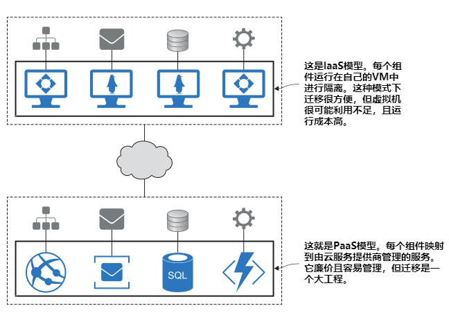
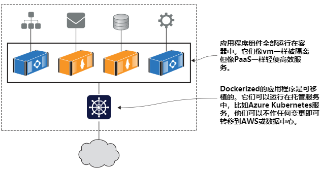
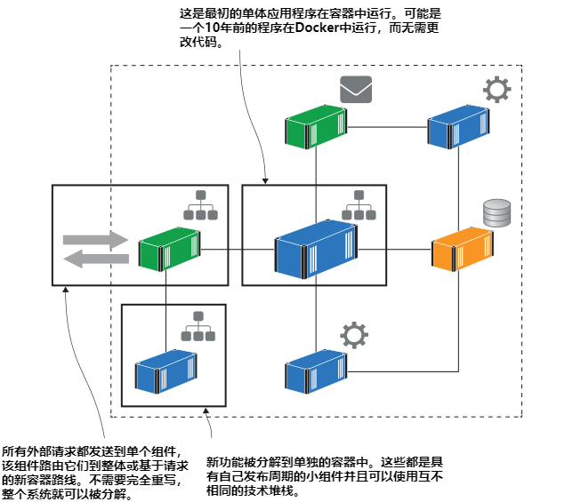
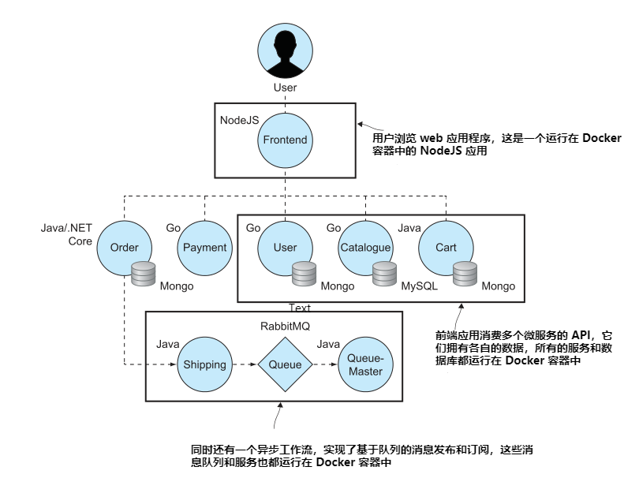
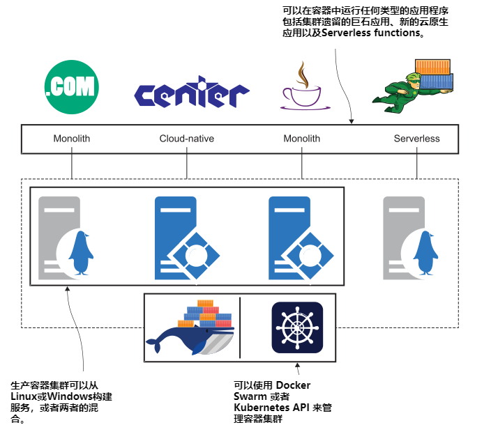

# 第一章 开始之前

Docker 是一个在称为容器的轻量级单元中运行应用程序的平台。
容器已经在软件中无处不在，从云上的 serverless functions 直至企业的战略规划。在相关的技术栈中，Docker 已然成为整个行业运营商和开发人员的核心竞争力。

Docker 是一门很容易学习的技术。你可以作为一个完全的初学者来阅读这本书，你将在第二章中运行容器，在第三章中封装在Docker中运行的应用程序。每一章都着重于实际操作，
在 Linx Mac Windows 等操作系统上都可以进行实操。

基于多年的磨练，你将跟随我一起学习 Docker。除了本章，都可以动手实操。在开始之前，了解容器是如何在现实世界被使用以及它可以解决的问题很有必要。同时将会说明我将如何教大家 docker，你可以弄清楚是否适合你。

现在让我们看看人们使用容器做了什么——我将介绍五个主要的容器
组织在Docker上取得巨大成功的场景。你会看到
使用容器可以解决很多问题，其中一些肯定会符合你的工作场景。读完本章你就会明白了
为什么 Docker 是一项你需要了解的技术，你会看到这本书是如何带你入门的。

## 1.1 为什么容器将会接管世界

我自己的Docker之旅始于2016年，当时我正在做一个基于 Docker 的 Paas 平台项目。我们开始使用 Docker 作为开发构建工具。然后我们获得了信心并开始运行 api用于测试环境的容器。在项目结束时，每个环境都是由 Docker驱动，包括生产，我们对可用性和规模有严格的要求。

当我离开这个项目时，向新团队的交接是单一的一个 GitLab 仓库的README文件。构建，部署和
管理应用程序(在任何环境中)的是Docker。新的开发人员获取源代码通过运行一个命令来构建和运行本地的一切。管理员使用完全相同的工具在生产集群中部署和管理容器。
 
通常这种规模的项目，移交需要两周时间。需要新的开发人员要安装半打特定版本的工具，管理员同样需要安装类似完全不同的工具。Docker集中了工具链，让所有事情都变得更容易，我认为有一天每个项目都必须这样做来使用容器。

近几年的发展，Docker 正在接近无所不在，部分原因是它使交付变得简单很多，部分原因是它非常灵活——你可以把它带进你所有的项目，包括旧的和新的，Windows 或者 Linux。

### 1.1.1 应用上云

将应用程序迁移上云是许多组织的首要任务。这个选择很吸引人，可以让微软、亚马逊或谷歌担心服务器、磁盘、网络或者影响力。在全球数据中心托管您的应用程序，具有几乎无限的扩展潜力。在几分钟内部署到新环境，并只收取您使用的资源的费用。但是，如何将应用程序放到云端？

 过去，将应用程序迁移到云有两种选择：基础设施即服务（IaaS）和平台即服务（PaaS）。两种选择都不好。您的选择基本上是一种妥协，选择PaaS并运行一个项目，将应用程序的所有部分从云迁移到相关的托管服务。这是一个艰难的选择，它将您锁定在一个云上，但它确实可以降低运行成本。另一种选择是IaaS，即为应用程序的每个组件启动虚拟机。您可以跨云移植，但运行成本要高得多。图1.1显示了使用IaaS和PaaS进行云迁移的典型分布式应用程序的形式。

图1.1 

Docker 提供了没有妥协的第三种选择。您可以迁移你的应用中的任何一部分到容器中，然后您可以使用 Azure Kubernetes Service或Amazon的Elastic container Service在容器中运行整个应用程序，或者在你自己的数据中心的Docker集群上运行整个应用。您将在第7章中学习如何在容器中打包和运行这样的分布式应用程序，在第13章和第14章中，您将了解如何在生产中大规模运行。图1.2显示了选择 Docker，它为您提供了一个可移植的应用程序，您可以在任何云中、数据中心或笔记本电脑上以低成本运行。

图1.2 

迁移到容器需要一些投资：您需要将现有的安装步骤转换为名为 Dockerfile 的脚本文件，并且使用类似 Docker Compose 或者 Kubernetes 格式的应用声明式清单文件来转换部署文档。你不需要更改任何的代码，最终从你的个人电脑到云端，以同样的方式使用同样的技术栈在所有环境运行应用程序。

### 1.1.2 更新旧版应用

你可以在云上容器运行任何的应用，但是如果你使用的是古老的单体设计那么你将不会充分利用 Docker 或者实现云平台的价值。单体应用在容器中工作的很好，但是它们限制了敏捷性。你可以在 30 秒内将新功能自动分阶段推到生产运行，但是如果该功能是由200 万行代码构建的整体的一部分，那么在发布之前，你可能必须经历一个两周的回归测试周期。

将您的应用程序迁移到 Docker 是现代化架构的第一步，采用新的模式而不需要完全重写应用程序。方法很简单——首先通过你将在本书中学习到的 Dockerfile以及 Docker Compose 的语法将您的应用程序部署到一个容器中。现在你在一个容器里有了一块巨石应用。

容器在它们自己的虚拟网络中运行，因此它们可以相互通信而不需要与外界接触。这意味着您可以开始将应用程序拆分，将特性移动到它们自己的容器中，这样渐渐地您的整体就可以演化为一个分布式应用程序，整个特性集由多个容器提供。图1.3显示了使用示例应用程序体系结构时的情况。

图1.3 

这种做法向您提供了微服务体系架构的许多好处。您的关键功能是在小的、隔离的单元中，您可以独立地管理它们。这意味着您可以快速测试更改，因为您更改的不是整体，而是运行特性的容器。您可以向上或向下扩展功能，并且可以使用不同的技术来满足需求。

使用 docker 对旧的应用程序体系结构进行现代化改造是很容易的—在第20章和第21章你可以通过实际的例子来验证。你可以交付一个更加敏捷、可扩展和有弹性的应用程序，而且你可以分阶段进行。

### 1.1.3 构建新的云原生应用

Docker 帮助您将现有的应用程序上云，无论它们是分布式应用程序还是单一应用程序。如果你有一个庞然大物，Docker可以帮助你把它们分解成现代的体系结构，无论你是在云上还是在数据中心运行。在Docker的帮助下，基于原生云原理构建的全新项目大大加快了速度。云原生基金会(CNCF)将这些新架构描述为使用“一个开源软件栈将应用程序部署为微服务，将每个部分打包到自己的容器中，并动态编排这些容器以优化资源利用。”

图1.4显示了一个新的微服务应用程序的典型架构——这是一个来自社区的演示应用程序，你可以访问[Demo](https://github.com/microservices-demo) 获取。

图1.4 

如果您想了解微服务的实际情况，它是一个很好的示例应用程序。每个组件都拥有自己的数据，并通过API公开数据。Frontend 是一个使用所有API服务的web应用程序。演示应用程序使用了各种编程语言和不同的数据库技术，但每个组件都有一个Dockerfile来打包它，整个应用程序在Docker Compose文件中定义。

您将在第4章学习如何使用Docker编译代码，作为打包应用程序的一部分。这意味着您不需要安装任何开发工具来构建和运行这样的应用程序。开发人员只需安装Docker，克隆源代码，用一个命令构建并运行整个应用程序。

Docker还可以方便地将第三方软件引入应用程序，无需编写自己的代码就可以添加功能。Docker Hub是一个公共服务，团队可以在这里共享运行在容器中的软件。CNCF发布了一份开源项目的地图，您可以将其用于从监视到消息队列的所有事情，而且它们都可以从Docker Hub免费获得。
### 1.1.4 技术创新：Serverless 等

现代 IT 的一个关键驱动因素是一致性:团队希望对所有项目使用相同的工具、过程和运行时。你可以用 Docker 做到这一点，从运行在Windows上的旧的.net整体程序到运行在Linux上的新Go应用程序，都可以使用容器。您可以构建一个Docker集群来运行所有这些应用程序，因此您可以以相同的方式构建、部署和管理整个应用程序环境。

技术创新不应该与常规应用分离。Docker是一些最大创新的核心，因此在探索新的领域时，您可以继续使用相同的工具和技术。最令人兴奋的创新之一(当然是继容器之后)是 serverless functions: 无服务器函数。图1.5显示了如何在单个Docker集群上运行所有应用程序(旧的单体应用程序、新的云原生应用程序和 serverless functions)，该集群可以运行在云端或数据中心。

图1.5 

Serverless 是与容器技术相关的。Serverless 的目标是让开发人员编写函数代码，将其推送给服务，然后服务构建并打包代码。当消费者使用该函数时，服务启动该函数的一个实例来处理请求。不需要构建服务器、管道或管理生产服务器;所有这些都由平台负责。

在底层，所有云上的 serverless 选择使用 Docker 来打包代码并通过容器来运行函数。但是云端的函数是不可移植的——您不能将AWS Lambda函数放到Azure中运行，因为没有针对serverless 的开放标准。如果你想要serverless 而没有云商锁定，或者如果你在数据中心运行，你可以使用Nuclio、OpenFaaS或Fn 项目在 Docker 中托管自己的平台，这些都是流行的开源 serverless 框架。

其他主要创新，如机器学习、区块链和物联网，都得益于Docker一致的打包和部署模型。你会发现所有部署到Docker hub的主要项目- tensorflow和Hyperledger都是很好的例子。物联网尤其有趣，因为Docker已经与Arm合作，使容器成为Edge和物联网设备的默认运行时。

### 1.1.5 利用 DevOps 进行数字化转型

所有这些场景都涉及到技术，但许多组织面临的最大问题是实际转型操作——特别是对大型和老企业而言。团队被划分为“开发人员”和“运维人员”，负责项目生命周期的不同部分。发布时的问题变成了一个责备循环，质量门被用来防止未来的失败。最终，你会有如此多的质量门槛，你一年只能管理两到三个版本，而且它们是有风险和劳动密集型的。

DevOps 旨在为软件部署和维护带来敏捷性，方法是让一个团队拥有整个应用程序生命周期，将“开发”和“运维”结合到一个交付产品中。DevOps主要是关于文化的改变，它可以将组织从巨大的季度发布变成小型的每日部署。但如果不改变团队使用的技术，就很难做到这一点。

运维人员可能有Bash、Nagios、PowerShell和System Center等工具的使用背景。开发人员在Make、Maven、NuGet和MSBuild中工作。当一个团队不使用通用技术时，很难将他们团结在一起，这正是Docker真正有用的地方。你可以通过迁移到容器来支持你的DevOps转换，突然之间，整个团队都在使用dockerfile和Docker Compose文件，使用相同的语言和相同的工具。

It goes further too. There’s a powerful framework for implementing DevOps called CALMS—Culture, Automation, Lean, Metrics, and Sharing. Docker works on all those initiatives: automation is central to running containers, distributed apps are built on lean principles, metrics from production apps and from the deployment process can be easily published, and Docker Hub is all about sharing and not duplicating effort.

## 1.2 这本书适合你吗?

## 1.3 创建你的实验环境

## 1.4 立即见效