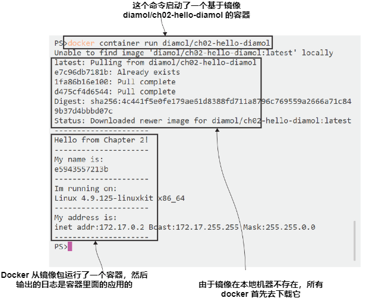
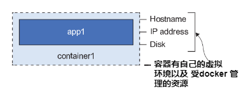
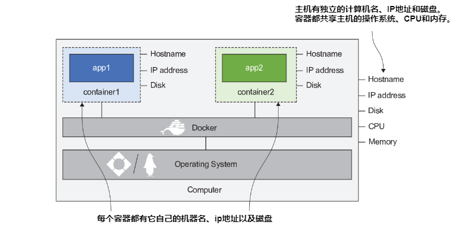
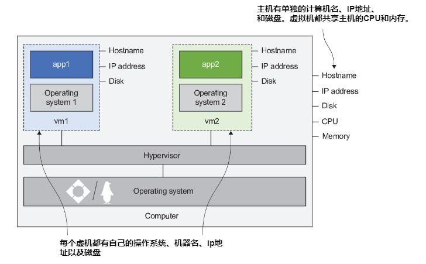
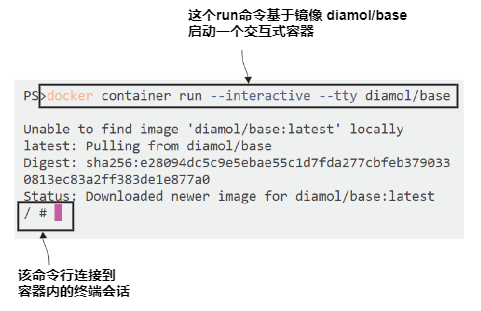
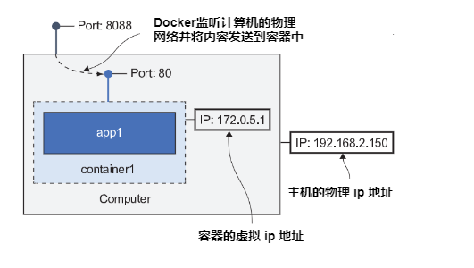
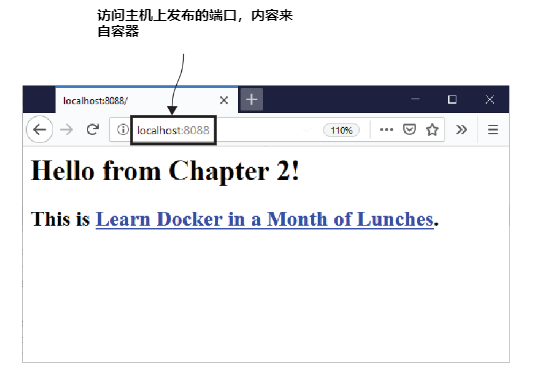
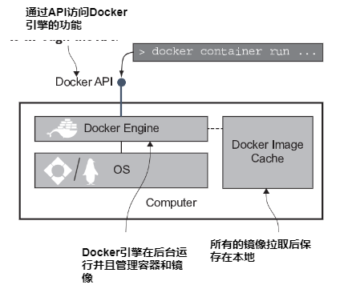
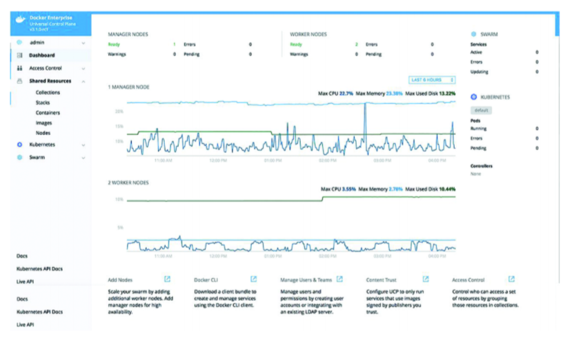

# 第二章 了解 Docker 并运行 Hello World

是时候动手使用 Docker了。在这一章,通过在容器中运行应用程序，你会了解到 Docker的核心特性。我还会讲到
一些背景知识，将帮助您准确理解容器是什么，以及为什么容器是运行应用程序的一种轻量级方式。你将会跟上
尝试一些练习，运行简单的命令来感受这种新的方式来处理应用程序。

## 2.1 运行 Hello World 容器

让我们以处理任何新的计算机概念的相同方式开始使用Docker: 即运行Hello World。在第一章你已经安装了 Docker 并运行了它，所以打开你最喜欢的终端——可以是Mac上的终端，也可以是Bash shell Linux，我推荐Windows中的 PowerShell。

你将执行 Docker 命令，让他运行一个可以输出类似 “Hello,World” 字样的容器。

<b>现在就试试</b> 运行下面的命令，将会运行一个 Hello World 容器:

`docker container run diamol/ch02-hello-diamol`

当你学完本章，你将会理解上面的命令执行后发生了什么。现在，你只需要看看输出，就像图 2.1 一样。


<center>图2.1 </center>

在这个输出中有很多内容。后面我将删减一些代码清单以保持简短，但是这是第一次尝试，我想把它完整地展示出来，这样我们就可以剖析它了。

首先，发生了什么？ docker 容器运行了命令告诉 Docker 引擎在一个容器中运行应用程序，该应用已经打包在 docker 运行并且发布到了所有人都可以访问的公共网站。这个所谓的容器包也就是“镜像”的名字是 `diamol/ch02-hello-diamol`, 上面的命令就是告诉 Docker 通过该镜像运行一个容器。 

在通过镜像运行容器之前，docker 必须在本地拥有一个镜像的副本。第一次运行命令，由于本地没有镜像副本，所以你可以看到首先输出的是：unable to find image locally。然后 Docker 下载了镜像（在 Docker 概念里叫做 "pulling" 拉取镜像）,然后你可以看到镜像已经被下载。

现在 Docker 使用该镜像启动了一个容器。该镜像包含了应用程序的所有内容以及告诉 Docker 如何启动应用的说明。这个镜像中，只是一个简单的脚本示例，输出了一些关于它所在机器的信息：
- 机器名，在本例中是 e5943557213b
- 操作系统，本例中是 Linux 4.9.125-linuxkit x86_64
- 网络地址，本例中是 172.17.0.2


你的输出和上面提到的应该差不多，并不是完全一样的，因为容器获得的信息取决于你自己的机器。如果你运行的是一个 windows 上的容器，那么输出可能是这样的：

```
--------------------- 
I'm running on:
Microsoft Windows [Version 10.0.17763.557]
---------------------
```

如果是树莓派，也可能是这样的：

```
---------------------
I'm running on:
Linux 4.19.42-v7+ armv7l
---------------------
```

这是一个非常简单的应用，但是它显示了 Docker 的核心流程。开发者将他们的程序打包在容器中运行（后面的章节会详细介绍如何制作镜像），然后将它发不出去，这样子别人也可以使用它。然后大家就可以在容器中运行它。docker 将这些过程描述为构建、分享、运行。

这是一个非常重要的概念，因为无论你的应用多么复杂，工作流程都是一样的。在本例中，仅仅执行了一个简单的脚本，但是也可以是一个包含多组件的 Java 程序、配置文件以及库等等。最后工作的过程也是一样的。然后镜像可以在任何支持 Docker 的机器中运行，可移植性就是 Docker的主要特点之一。

那么如果你使用同样的命令再次运行一个容器会发生什么？

<b>现在就试试</b> 重复执行同样的 Docker 命令:

`docker container run diamol/ch02-hello-diamol`

您将看到与第一次运行类似的输出，但也有不同之处。Docker 已经在本地拥有镜像的副本，因此不需要先下载镜像;它直接运行容器。容器输出显示相同的操作系统信息，因为你们使用的是同一台计算机，但是计算机名和容器的IP地址将不同:

```
Hello from Chapter 2!
---------------------
My name is:
858a26ee2741 
---------------------
Im running on:
Linux 4.9.125-linuxkit x86_64
---------------------
My address is:
inet addr:172.17.0.5 Bcast:172.17.255.255 Mask:255.255.0.0
---------------------
```

现在，我的应用程序运行在一台名为 858a26ee2741 和IP地址为 172.17.0.5 的机器上. 机器名称每次都会更改，IP地址也经常改变，但是每个容器都在同一台计算机上运行，所以这些差异在哪里呢？不同的机器名称和网络地址来自哪里?我们将深入研究一些理论
，接下来解释一下，然后继续练习。

## 2.2 什么是容器？

你可以把 Docker 容器想象成一个包含应用程序的物理盒子。在盒子里，应用程序似乎有它自己独立的计算机环境：它有自己的机器名和IP地址，也有自己的磁盘驱动器（Windows容器也有自己的Windows注册表）。图2.2显示了应用程序是如何被容器装箱的。


<center>图2.2 </center>

被 Docker 创建的资源：像主机名、ip地址以及文件系统等都是虚拟的，他们都是被 docker 管理的逻辑对象，他们被放在一起，用于创建一个应用程序可以运行的环境，就像一个容器的盒子。


这个盒子里的应用程序无法访问盒子外面的世界，但是盒子是运行在一台计算机中的，同时该计算机可以运行很多其他的盒子。这些盒子里的应用拥有各自隔离的环境，但是它们共享主机的 cpu 以及内存，同时也共享主机的操作系统。在图2.3中可以看到同一台计算机上的容器是如何隔离的。


<center>图2.3 </center>

为什么以上如此重要?它解决了计算中两个相互冲突的问题:隔离和密度。密度意味着在您的计算机上运行尽可能多的应用程序，以利用所有的处理器和内存。但是应用程序可能不能很好地与其他应用程序一起工作——它们可能使用不同版本的Java或.net，它们可能使用不兼容版本的工具或库，或者一个应用程序的工作负载很重，使其他应用程序的处理能力不足。应用程序确实需要彼此隔离，这阻止了您在一台计算机上运行大量应用程序，因此您无法获得密度。

解决这个问题的最初尝试是使用虚拟机(vm)。虚拟机在概念上与容器相似，它们提供一个盒子来运行您的应用程序，但虚拟机的盒子需要包含它自己的操作系统-它与虚拟机所在计算机的操作系统不同。对比图2.3，其中显示了一台计算机中的多个容器，如图2.4所示，显示了一台计算机中的多个虚拟机。


<center>图2.4 </center>

对比两张图，可以看到一些小的差异，但这点差异有着巨大的影响。每个虚拟机都需要自己的操作系统，而该操作系统可以占用千兆字节的内存和大量CPU时间，消耗了本应给予你的应用的计算能力。然后，还有其他问题，比如操作系统的许可成本以及安装OS更新的维护负担。VM牺牲了密度以提供隔离性。

容器让你两者兼得。每个容器共享主机的操作系统，这使它们变得非常轻量。容器快速启动并精简运行，因此您可以在同一个平台上运行比虚拟机多得多的容器，通常是虚机下硬件资源的五到十倍。你获得了密度，但每个应用程序都有自己的容器，所以你也会被隔离。这是Docker的另一个关键特性：效率。

现在你已经知道 Docker 是如何发挥其魔力了。在下一个练习中，我们会更深入的运用容器。

## 2.3 像远程连接计算机一样连接容器

我们运行的第一个容器只做了一件事,打印了一些文本然后就结束了。在很多情况下，你只想做一件事。也许您有一整套脚本可以自动化某些过程,这些脚本需要运行一组特定的工具，因此您不能只与同事共享脚本；你还需要共享一份文档，该文档描述了所有工具的设置，然后同事需要花费数小时安装它们。相反，您可以在 Docker 镜像中打包工具和脚本，共享该镜像，然后您的同事可以运行容器中的脚本，而无需额外的设置工作。
 
你也可以用其他方式处理容器。接下来，您将了解如何运行容器并连接到容器内的终端，就像您连接到远程计算机一样。使用相同的docker容器运行命令，但是需要一些附加标志用于运行具有连接的终端会话的交互式容器。

<b>现在就试试</b>在你的终端运行下面的命令:

`docker container run --interactive --tty diamol/base`

`--interactive` 参数告诉 Docker 你想建立一个到容器的连接，而 `--tty` 参数表示你想要连接到容器内的终端会话。输出将显示 Docker 拉取镜像，然后您将看到终端命令提示符，该命令提示符用于控制容器内的终端会话-如图2.5所示。


<center>图2.5 </center>

完全相同的 Docker 命令在 Windows 上的运行方式也是同样的：

```
Microsoft Windows [Version 10.0.17763.557]
(c) 2018 Microsoft Corporation. All rights reserved.
C:\>
```

无论哪种方式，您现在已经进入到容器中，可以运行任何操作系统的命令。

<b>现在就试试</b> 运行 hostname 以及 date 命令，可以看到容器环境的输出信息：

```
/ # hostname 
f1695de1f2ec
/ # date 
Thu Jun 20 12:18:26 UTC 2019
```

你可以深入使用，就像 ssh 到linux 机器或者通过 RDP 协议远程到 windows server 机器一样。
 
请记住，容器共享主机的操作系统，这就是为什么在 linux 机器运行容器时会看到Linux shell，而在Windows 机器运行容器时会看到Windows命令行。

不管你是基于什么类型的系统运行的容器，最终对应用的管理是没有影响的，无论你在容器中运行什么，管理容器的方式是一样的。

<b>现在就试试</b> 打开一个新的终端会话，通过如下命令获取所有运行状态的容器：

`docker container ls`

命令执行的输出将显示每个容器的信息，包括使用的镜像信息、容器的 id 以及容器启动时docker 内部执行的命令，类似下面：

```
CONTAINER ID IMAGE COMMAND CREATED STATUS 
f1695de1f2ec diamol/base "/bin/sh" 16 minutes ago Up 16 minutes 
```

如果您目光敏锐，就会注意到容器的 ID 与容器的主机名相同，Docker 为它创建的每个容器分配一个随机ID，并且该ID的一部分用于主机名。您可以使用许多docker容器命令指定容器id 的前几位与特定的容器进行交互。


<b>现在就试试</b> docker container top 命令列出了容器中运行的进程，我使用f1作为容器ID f1695de1f2ec的缩写形式：

```
> docker container top f1
PID USER TIME COMMAND 
69622 root 0:00 /bin/sh
```

如果你的容器中不止一个进程在运行，那么将显示所有的进程。Windows 下运行容器就是这样，它总是有几个在容器应用程序之外后台运行的进程。

<b>现在就试试</b> docker container logs 命令显示了容器执行输出的日志信息：

```
> docker container logs f1
/ # hostname
f1695de1f2ec
```

Docker 使用容器中应用程序的输出收集日志条目。在此前终端会话中，我看到了我运行的命令及其结果，但对于在实际应用程序中，您将看到程序代码的日志条目。例如，web应用程序
可以为处理的每个HTTP请求写入日志条目，这些将显示在容器日志中。

<b>现在就试试</b> docker container inspect 命令查看容器详情:

```
> docker container inspect f1
[ 
 {
 "Id": 
"f1695de1f2ecd493d17849a709ffb78f5647a0bcd9d10f0d97ada0fcb7b05e98",
 "Created": "2019-06-20T12:13:52.8360567Z"
```

完整的输出显示了很多底层的信息，包括容器的虚拟文件系统路径、容器中运行的命令以及容器连接的虚拟Docker 网络。这些信息在你解决应用程序问题时是很有用的。它是一大块JSON，对于自动化脚本可能会有用处，但对于书中的代码显示来说就不太好了，所以我只展示了前几行。
 
这些都是一些常用的命令，比如当你检查应用程序的网络、cpu大量占用等等
 
这些练习体现了另外一点，那就是所有的容器看起来都差不多。Docker 在每个应用程序的顶部添加了一个管理层，你可以让一个 10年前的 Java 应用运行在 Linux 容器中，让一个15年前的 .net 应用运行在 windows 容器中，以及一个新的 go程序运行在树莓派中。你将使用同样的命令管理它们：启动、查看日志、查看进程以及查看明细。
 
到现在，您已经看到了使用Docker可以做很多事情；我们会用一些练习运行更丰富的应用。

## 2.4 在容器中运行 Web 站点

我们已经运行了一些容器， 输出一些简单的文本信息，然后使用了 interactive 参数并连接到了容器内的会话终端, 当你退出时容器也就停止运行了，docker container ls 命令执行后你看不到任何容器,因为这个命令只显示运行态的容器。

<b>现在就试试</b> 运行 docker container ls --all, 显示所有状态的容器:

```
> docker container ls --all
CONTAINER ID IMAGE COMMAND 
CREATED STATUS 
f1695de1f2ec diamol/base "/bin/sh" 
About an hour ago Exited (0)
858a26ee2741 diamol/ch02-hello-diamol "/bin/sh -c ./cmd.sh" 3 hours 
ago Exited (0)
2cff9e95ce83 diamol/ch02-hello-diamol "/bin/sh -c ./cmd.sh" 4 hours 
ago Exited (0)
```

可以看到 Existed 状态的容器，有两点需要知道： 

第一点，只有当容器中运行的应用是运行状态时容器才是运行状态. 一旦应用程序运行退出,那么容器也将变成 exited 状态。退出状态的容器不会占用任何 cpu 和内存资源。 之前的 Hello Word 容器，在内部的脚本完成时退出，还有之前我们连接进去的交互式容器当我们在退出时也变成退出状态。
 
第二点， 容器退出时并不会消失。退出状态的容器还是存在的,这就意味着你可以再次启动他们。`docker container ls` 只能看到运行状态容器,docker 不会删除 exited 状态的容器，除非你明确执行了删除操作。existed 容器也占用磁盘空间，因为他们的文件系统就保存在主机磁盘上。

那么启动一个容器，让它保持在后台运行有什么意义？这实际上是 Docker 最主要的用法：运行服务器应用程序就像web 站点、批处理以及数据库等。

<b>现在就试试</b> 在容器中运行一个 web 站点:

```
docker container run --detach --publish 8088:80 diamol/ch02-hello-diamol-web
```

这一次执行的输出只能看到一个很长的容器 id，然后输出完成后回到你自己的命令行，容器以后台方式保持运行状态。

<b>现在就试试</b> 运行 docker container ls 可以看到你刚刚运行的容器保持运行状态:

```
> docker container ls
CONTAINER ID IMAGE 
COMMAND CREATED STATUS 
PORTS NAMES
e53085ff0cc4 diamol/ch02-hello-diamol-web 
"bin\\httpd.exe -DFOR…" 52 seconds ago Up 50 seconds 
443/tcp, 0.0.0.0:8088->80/tcp reverent_dubinsky
```

你刚刚使用的镜像是 `diamol/ch02-hello-diamol-web`， 这个镜像里面包括了一个 Apache web server 以及一个简单的 html 页面文件。当你运行这个容器，你将运行一个完整的 web 服务，提供一个自定义网站。容器位于后台并监听网络流量(在本例中是HTTP请求)，用到了两个特别的参数:
- `--detach` — 在后台启动容器并显示容器ID
- `--publish` — 将容器端口从容器映射到主机端口

运行一个分离的容器只是把容器放在后台，这样它就启动了并保持后台运行，就像Linux守护进程或Windows服务一样。关于发布端口需要更多的解释：当您安装Docker时，它将自己注入到您的
计算机的网络层，进入你电脑的流量会被拦截，通过Docker，然后Docker可以把流量发送到某个容器。
 

默认情况下，容器不会对外暴露端口。它们都有自己的IP地址，但那是受 docker 管理的网络创建的—容器没有附加到主机的物理网络上。发布容器端口意味着 Docker监听计算机上的网络流量端口，然后将其发送到容器中。在上面的例子中，发送到主机端口 8888 的流量将被发送到端口 80 的容器中——您可以看到图2.6中的流向：


<center>图2.6 </center>

在这个例子中，我的计算机运行 Docker，它拥有 IP 地址192.168.2.150，那是我物理网络的IP地址，而且它是由路由器分配的。Docker正在运行一个单一的容器，容器的IP地址为172.0.5.1。那个地址是 Docker 管理的虚拟网络分配的。网络中的其他计算机是无法连接到这个容器 ip 的，因为它只存在于Docker中，但是他们可以将流量发送到容器中，因为端口被转发出去。

<b>现在就试试</b> 通过浏览器访问 http://localhost:8088 ，这是一个指向我本地计算机的请求, 但是响应 (查看图 2.7) 来自于容器。


<center>图2.7 </center>

这是一个非常简单的网站，即使如此，这个应用程序仍然受益于 Docker 的可移植性及其带来的效率。网页内容是和网页服务器一起打包的，所以Docker 镜像拥有它所需要的一切。web开发人员可以在他们的个人计算机上运行单个容器及整个应用程序——从HTML到web服务器栈。
 
此容器中的应用程序将无限期地运行，因此容器将持续运行。您可以使用我们已经使用过的docker container 命令去管理它。

<b>现在就试试</b> docker container stats 另一个很有用的命令: 它实时显示了容器占用的 CPU、内存、网络以及磁盘情况。Linux 和 windows 上运行的输出可能会有点区别:

```
> docker container stats e53 
CONTAINER ID NAME CPU % PRIV WORKING SET NET I/O 
BLOCK I/O
e53085ff0cc4 reverent_dubinsky 0.36% 16.88MiB 250kB / 53.2kB
19.4MB / 6.21MB
```

当你的容器结束工作,你可以通过 `docker container rm ` 删除它, 通过 `--force` 参数可以强制删除运行状态的容器。

我们将通过一个经常使用的命令来结束本次练习。

<b>现在就试试</b> 运行下面的命令删除所有的容器:

`docker container rm --force $(docker container ls --all --quiet)`

$() 语法通过将命令的输出输入到另外一个命令，它在 linux 、mac 终端以及 windows 的 PowerShell 下都能正常使用。这两个命令的组合获得了你机器上的所有容器 id 然后强制删除它们。这是一个清理你容器的比较便捷的方式，但是使用时要注意，它不会二次确认直接删除。

## 2.5 理解 Docker 如何运行容器

在本章中我们已经进行了很多联练习，你现在应该很开心，你已经掌握了容器的基本使用。
 
本章开始的第一次尝试，我们讨论了关于 docker 核心的构建、分享以及运行流程。该流程使得分发软件非常简单，我已经构建了所有的样例镜像并分享出来，现在你可以通过 Docker 运行它们。很多项目现在选择 Docker 作为它们发布软件的方式，你可以尝试通过同样的 Docker 命令来运行一个新的软件，比如说Elasticsearch，或者最新版本的SQL Server，或者Ghost博客引擎。
 
我们将讲解更多的背景知识来结束本章，这样你们就能有一个稳固的理解关于：当你用Docker运行应用程序时，实际发生了什么。安装Docker和运行容器看起来很简单，但实际上涉及了一些不同的组件，如图2.8所示。


<center>图2.8 </center>

- Docker 引擎作为 Docker 主要的管理组件，它负责本地镜像缓存，当你需要镜像时下载它们，并在你已经下载时重复使用它们。它同样协同操作系统去创建容器、虚拟网络以及其它的容器资源。Docker 引擎作为后台进程持续运行（就像一个 linux 后台进程或者 windows 的服务）。
- Docker引擎通过 Docker API 提供了所有的功能，它只是一个标准的基于http的REST API。您可以配置引擎使API只能从本地计算机访问(这是默认值)，
或者让网络上的其他计算机也可以使用它。
-  Docker命令行接口(CLI)是Docker API的一个客户端。当你运行Docker命令，CLI会将它们发送到Docker API，而 Docker 引擎完成具体的工作。

理解 Docker 的体系结构对你来说很重要。唯一与 Docker 互动的方法就是通过 API 实现的，然后有不同的配置选项可以访问API以及保护它。CLI的工作原理就是向 API 发送请求。
 
到目前为止，我们使用CLI来管理Docker所在计算机上运行的容器，但是您可以将您的 CLI 指向运行Docker的远程机器，并控制该机器上的容器— 这就是你后面所要做的在不同的环境中管理容器，比如构建服务、测试以及部署到生产。Docker API 在每个操作系统上都是一样的，所以你可以在你的Windows笔记本电脑上使用命令行管理树莓派上的容器，或者云中Linux服务器上的容器。
 
Docker API 有一个发布的规范，Docker CLI 并不是唯一的客户端类型，有一些图形用户界面可以连接 docker api 然后以可视化界面的方式来管理容器。API公开了所有细节，包括容器、镜像以及 Docker 管理的其他资源，这样就可以展现一个非常丰富的仪表板，如图2.9所示：


<center>图2.9 </center>

这是一个叫做 UCP 的程序，一款基于 Docker 的商业产品 (https://docs.docker.com/ee/ucp/)。Portainer是另一种选择，它是一个开源项目。UCP和Portainer 本身都可以以 docker 方式运行，所以它们很容易部署和管理。

我们不会再深入讨论 Docker 架构了，Dcoker 引擎使用一个叫做 containerd 的组件来实际管理容器,然后 Containerd 反过来利用操作系统特性来创建虚拟的容器环境。
 
您不需要了解容器的底层细节，但是了解它是有好处的，要知道: containerd 是一个由 CNCF 监管的开源组件，它运行容器的规范是开源公开的;它被称为 OCI。
 
Docker是迄今为止最流行、最容易使用的容器平台，但它不是唯一的一个。您可以自信地投身于容器，而不必担心被锁定在固定的供应商的平台上。

## 2.6 实验室：索引容器文件系统

这是本书提到的第一个实验室，本次实验室给你设定了一个任务，你必须自己完成，这将有助于巩固你在本章学习的内容。实验中将会有一些指导和提示，但是主要还是靠你自己去完成它。
 
每个实验在本书的 github 仓库都有一些示例解决方案，非常值得你自己花点时间进行一些尝试，如果你想查看解决方案可以访问：https://github.com/yyong-brs/learn-docker/tree/master/diamol/ch02/lab。

这就开始吧：您的任务是运行本章中的网站容器，然后替换 index.html 文件内容，这样子当您访问网站时，会看到不同的主页。记住，容器有自己的
文件系统，在这个应用程序中，网站提供的文件位于容器的文件系统中。
以下是一些让您完成实验的提示：

- 你可以直接运行 `docker container` 命令来查看针对容器可以执行的相关命令。

- 添加 `--help` 参数可以看到详细的帮助信息。

- 在镜像 `diamol/ch02-hello-diamol-web` 中, web 站点提供的首页文件在容器的文件系统目录：` /usr/local/apache2/htdocs` 下 (如果是 windows 就在目录 C:\usr\local\apache2\htdocs 下). 

祝你好运 :)