# 第三章 构建你自己的镜像

在上一章你已经通过 Docker 运行了一些容器，本章将让你了解如何构建自己的镜像。你将接触到学习 Dockerfile语法以及一些构建镜像的技巧。

## 3.1 使用 Docker Hub 的镜像

我们将从您将在本章中构建的镜像的最终版本开始，可以看到它是如何与Docker协同工作的。现在就试试吧，使用一个名为web-ping的简单应用程序，它检查网站是否正常。应用程序
将在容器中运行，并每隔三秒钟执行一次直到容器停止。

你从第2章中知道 docker container run 命令执行时，将会下载你机器上还没有镜像。这是因为软件被分发到了 Docker 平台中，你可以让 Docker 来管理应用，当你需要的时候它会提取镜像或者你可以显式地通过 Docker ClI 运行。

<b>现在就试试</b> 拉取 web-ping 应用的镜像:

```
docker image pull diamol/ch03-web-ping
```

你将会看到 图3.1 类似的输出：

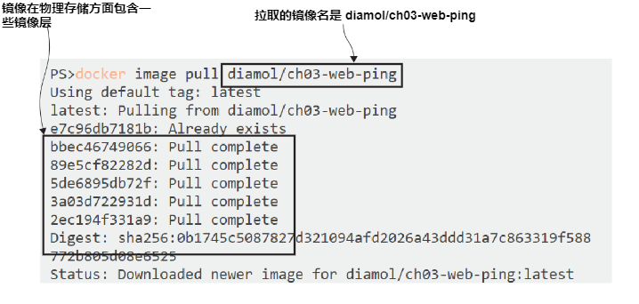
<center>图3.1 </center>

镜像名称是 `diamol/ch03-web-ping` ,它被存储在 Docker Hub 中。Docker Hub 是 Docker 获取镜像的默认仓库。镜像服务器被称为 registry,然后 Docker Hub 是你可以使用的一个免费的公共 registry。同时 Docker Hub 也提供了 web 界面，你可以通过网站 https://hub.docker.com/r/diamol/ch03-web-ping 来获取上面提到的镜像的信息。

`docker image pull` 命令有一些有趣的输出,它向您展示镜像如何存储。Docker 镜像在逻辑上是可以把它看作一个包含整个应用程序堆栈的大的zip文件。这个镜像包含了 Node.js运行时以及我的应用程序代码。

在拉取过程中，你看不到一个文件被下载;但是你会看到很多下载的信息。这些被称为镜像层。Docker 镜像在物理上被存储为许多小文件，Docker 将它们组装在一起创建容器的文件系统。当所有镜像层都被拉取后，完整的镜像就可用使用了。

<b>现在就试试</b> 让我们基于这个镜像运行一个容器并且看看应用做了什么:

`docker container run -d --name web-ping diamol/ch03-web-ping`

`-d` 参数是 `--detach` 的简写，所以这个容器将在后台运行。这个程序运行时就像一个没有用户界面的批处理任务，不像我们之前在第二章运行的 web 站点容器，这个容器不再接收网络请求，所以你不用公开任何的端口。

这里出现了一个新的参数 `--name`,你知道的你可以使用 Docker 生成的 ID 来管理容器，但是你也可以给容器一个友好的名字。在这个容器中被命名为 web-ping ,你可以使用这个名字来替代随机生成的 id 来指向容器。

我的博客网站现在被你运行的容器中的应用 ping，这个应用运行在一个无限循环中，你可以通过在第二章中熟悉的命令来查看做了些什么。

<b>现在就试试</b> 查看一下容器产生的日志:
`docker container logs web-ping`

你将会看到类似 图 3.2 的输出，显示了应用请求 博客网站的信息：

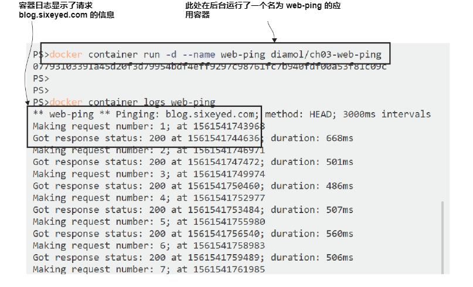
<center>图3.2 </center>

一款能够发出网络请求并记录响应时间的应用程序是相当有用的，您可以使用它作为监控网站正常运行时间的基础。但是这个应用程序看起来像是用我的博客的硬编码，所以除了我，它对任何人都没什么用。

但事实并非如此。应用程序实际上可以配置为使用不同的URL、请求之间的不同间隔，甚至是不同类型的HTTP调用。这个应用程序从系统环境中读取它应该使用的配置值变量。

环境变量只是操作系统提供的键/值对。它们在 Windows 和 Linux 上以相同的方式工作，而且它们是一种非常简单的方法来存储小块数据。Docker容器也有环境变量，但是它们不是来自计算机的操作系统，而是由 Docker 设置的，这与 Docker为容器创建主机名和IP地址的方式相同。

web-ping 镜像为环境变量设置了一些默认值。当你运行一个容器，那些环境变量被Docker填充，那是应用程序使用什么来配置网站的URL。可以在创建容器时指定不同的环境变量值，这将改变应用程序的行为。

<b>现在就试试</b> 删除之前运行的容器，通过指定 TARGET 环境变量值来运行一个新的容器：

```
docker rm -f web-ping
docker container run --env TARGET=google.com diamol/ch03-web-ping
```
你可以看到图 3.3 类似的输出:

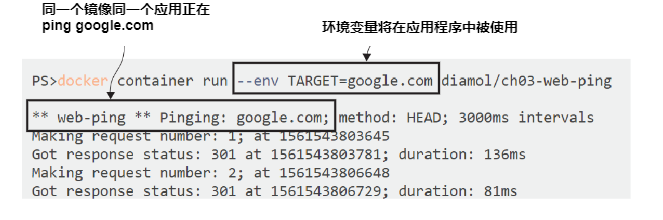
<center>图3.3 </center>

这个容器正在做一些不同的事情。首先，它是交互式运行的，因为你没有使用 `--detach` 标志，因此应用程序的输出显示在控制台。容器将继续运行，直到按Ctrl-C结束应用程序。第二,现在是 pinging google.com 而不是 blog.sixeyed.com。

这将是你从本章中学到的主要内容之一——docker 镜像可以打包为应用程序的一组默认配置值，但是您应该能够在运行容器时提供不同的配置设置。

环境变量是实现这一点的一种非常简单的方法。web-ping应用程序代码查找带有 TARGET 键的环境变量，那个键有一个在镜像中的blog.sixeyed.com的值，但您可以用`docker container run `命令使用 `--env` 参数。图3.4显示了如何让容器有自己的设置，它们彼此不同，也不同于镜像。

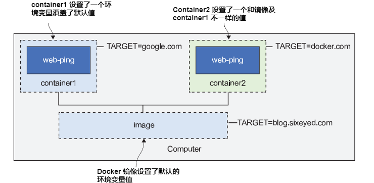
<center>图3.4 </center>

主机也有它自己的一组环境变量，但它们和容器的环境变量是分开管理的。每个容器只有 Docker 填充的环境变量。图3.4中重要的一件事是 web-ping 应用程序在每个容器中都是相同的—它们使用相同的镜像，因此应用程序正在运行完全相同的二进制文件集，但由于配置的不同，其行为有所不同。

这取决于 Docker 镜像的作者来提供这种灵活性，而当你从Dockerfile构建你的第一个 Docker 镜像时，我们会看到如何做到这一点。
## 3.2 编写第一个 Dockerfile

The Dockerfile is a simple script you write to package up an application—it’s a set of
instructions, and a Docker image is the output. Dockerfile syntax is simple to learn,
and you can package up any kind of app using a Dockerfile. As scripting languages
go, it is very flexible. Common tasks have their own commands, and for anything
custom you need to do, you can use standard shell commands (Bash on Linux or
PowerShell on Windows). Listing 3.1 shows the full Dockerfile to package up the
web-ping application.

> Listing 3.1 The web-ping Dockerfile

```
FROM diamol/node
ENV TARGET="blog.sixeyed.com"
ENV METHOD="HEAD"
ENV INTERVAL="3000"
WORKDIR /web-ping
COPY app.js .
CMD ["node", "/web-ping/app.js"]
```

Even if this is the first Dockerfile you’ve ever seen, you can probably take a good guess
about what’s happening here. The Dockerfile instructions are FROM, ENV, WORKDIR,
COPY, and CMD; they’re in capitals, but that’s a convention, not a requirement. Here’s
the breakdown for each instruction:
- FROM—Every image has to start from another image. In this case, the web-ping
image will use the diamol/node image as its starting point. That image has
Node.js installed, which is everything the web-ping application needs to run.
- ENV—Sets values for environment variables. The syntax is [key]="[value]",
and there are three ENV instructions here, setting up three different environ-
ment variables.
- WORKDIR—Creates a directory in the container image filesystem, and sets that to
be the current working directory. The forward-slash syntax works for Linux and
Windows containers, so this will create /web-ping on Linux and C:\web-ping
on Windows.
- COPY—Copies files or directories from the local filesystem into the container
image. The syntax is [source path] [target path]—in this case, I’m copying
app.js from my local machine into the working directory in the image.
- CMD—Specifies the command to run when Docker starts a container from the
image. This runs Node.js, starting the application code in app.js.

That’s it. Those instructions are pretty much all you need to package your own appli-
cations in Docker, and in those five lines there are already some good practices.

TRY IT NOW
You don’t need to copy and paste this Dockerfile; it’s all there in
the book’s source code, which you cloned or downloaded in chapter 1. Navi-
gate to where you downloaded it, and check that you have all the files to build
this image:

```
cd ch03/exercises/web-ping
ls
```

You should see that you have three files:
- Dockerfile (no file extension), which has the same content as listing 3.1
- app.js, which has the Node.js code for the web-ping application
- README.md, which is just documentation for using the image

You can see these in figure 3.5.

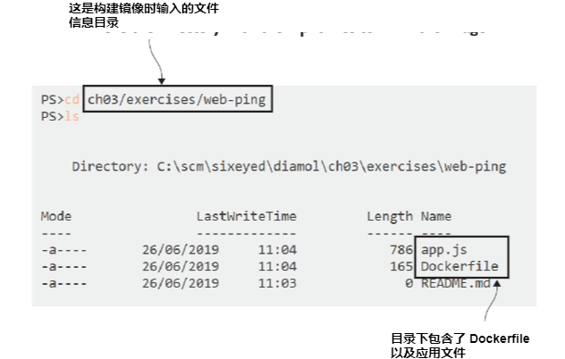
<center>图3.5 </center>

You don’t need any understanding of Node.js or JavaScript to package this app and
run it in Docker. If you do look at the code in app.js, you’ll see that it’s pretty basic,
and it uses standard Node.js libraries to make the HTTP calls and to get configuration
values from environment variables.

In this directory you have everything you need to build your own image for the
web-ping application.

## 3.3 构建镜像

Docker needs to know a few things before it can build an image from a Dockerfile. It
needs a name for the image, and it needs to know the location for all the files that it’s
going to package into the image. You already have a terminal open in the right direc-
tory, so you’re ready to go.

TRY IT NOW
Turn this Dockerfile into a Docker image by running docker
image build:
docker image build --tag web-ping .

The --tag argument is the name for the image, and the final argument is the direc-
tory where the Dockerfile and related files are. Docker calls this directory the “con-
text,” and the period means “use the current directory.” You’ll see output from the
build command, executing all the instructions in the Dockerfile. My build is shown in
figure 3.6.

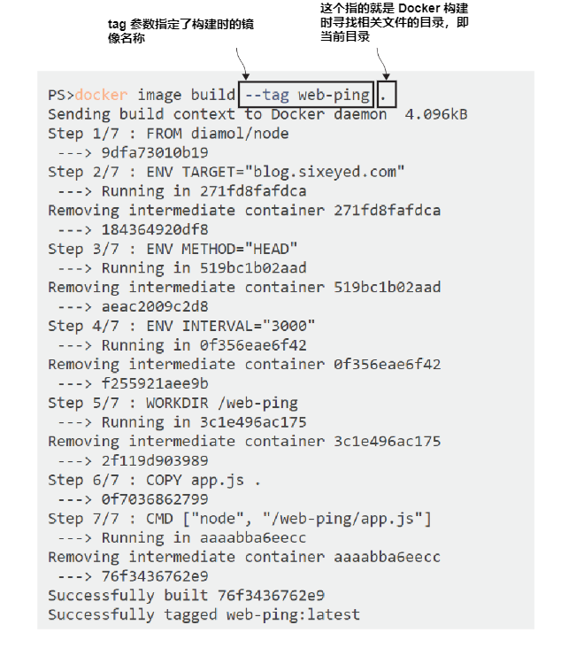
<center>图3.6 </center>

If you get any errors from the build command, you’ll first need to check that the
Docker Engine is started. You need the Docker Desktop app to be running on Win-
dows or Mac (check for the whale icon in your taskbar). Then check that you’re in the
right directory. You should be in the ch03-web-ping directory where the Dockerfile and
the app.js files are. Lastly, check that you’ve entered the build command correctly—the
period at the end of the command is required to tell Docker that the build context is
the current directory.

If you get a warning during the build about file permissions, that’s because you’re
using the Docker command line on Windows to build Linux containers, thanks to
Docker Desktop’s Linux container mode. Windows doesn’t record file permissions in
the same way that Linux does, so the warning is telling you that all the files copied
from your Windows machine are set with full read and write permissions in the Linux
Docker image.

When you see the “successfully built” and “successfully tagged” messages in the
output, your image is built. It’s stored locally in your image cache, and you can see it
with the Docker command to list images.

TRY IT NOW
List all the images where the tag name starts with “w”:
docker image ls 'w*'

You’ll see your web-ping image listed:

```
> docker image ls w*
REPOSITORY TAG IMAGE ID CREATED SIZE
web-ping latest f2a5c430ab2a 14 minutes ago 75.3MB
```

You can use this image in exactly the same way as the one you downloaded from
Docker Hub. The contents of the app are the same, and the configuration settings can
be applied with environment variables.

TRY IT NOW
Run a container from your own image to ping Docker’s website
every five seconds:
docker container run -e TARGET=docker.com -e INTERVAL=5000 web-ping

Your output will be like mine in figure 3.7, with the first log line confirming that the
target web URL is docker.com and the ping interval is 5000 milliseconds.

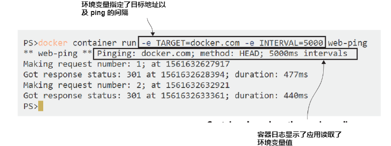
<center>图3.7 </center>

That container is running in the foreground, so you’ll need to stop it with Ctrl-C. That
ends the application, and the container will go into the exited state.

You’ve packaged a simple application to run in Docker, and the process is exactly
the same for more complicated apps. You write the Dockerfile with all the steps to
package your app, collect the resources that need to go into the Docker image, and
decide how you want users of your image to configure the behavior of the app.
## 3.4 理解 Docker 镜像以及镜像层

You’ll be building plenty more images as you work through this book. For this chapter
we’ll stick with this simple one and use it to get a better understanding of how images
work, and the relationship between images and containers.

The Docker image contains all the files you packaged, which become the con-
tainer’s filesystem, and it also contains a lot of metadata about the image itself. That
includes a brief history of how the image was built. You can use that to see each layer
of the image and the command that built the layer.

TRY IT NOW
Check the history for your web-ping image:
docker image history web-ping

You’ll see an output line for each image layer; these are the first few (abbreviated)
lines from my image:

```
> docker image history web-ping
IMAGE CREATED CREATED BY
47eeeb7cd600 30 hours ago /bin/sh -c #(nop) CMD ["node" "/web-ping/ap…
<missing> 30 hours ago /bin/sh -c #(nop) COPY file:a7cae366c9996502…
<missing> 30 hours ago /bin/sh -c #(nop) WORKDIR /web-ping
```

The CREATED BY commands are the Dockerfile instructions—there’s a one-to-one rela-
tionship, so each line in the Dockerfile creates an image layer. We’re going to dip into
a little more theory here, because understanding image layers is your key to making
the most efficient use of Docker.

A Docker image is a logical collection of image layers. Layers are the files that are
physically stored in the Docker Engine’s cache. Here’s why that’s important: image
layers can be shared between different images and different containers. If you have
lots of containers all running Node.js apps, they will all share the same set of image
layers that contain the Node.js runtime. Figure 3.8 shows how that works.

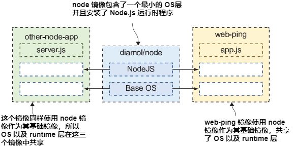
<center>图3.8 </center>

The diamol/node image has a slim operating system layer, and then the Node.js run-
time. The Linux image takes up about 75 MB of disk (the base OS layer for Windows
containers is larger, so the Windows version of the image uses closer to 300 MB). Your
web-ping image is based on diamol/node, so it starts with all the layers from that
image—that’s what the FROM instruction in the Dockerfile gives you. The app.js file
you package on top of the base image is only a few kilobytes in size, so how big is the
web-ping image in total?

TRY IT NOW
You can list images with docker image ls, which also shows the
size of the image. If you don’t include a filter in the command, you’ll see all
images:
docker image ls

Your output will be like mine in figure 3.9.

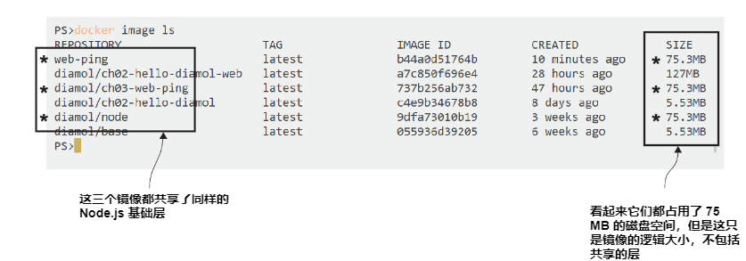
<center>图3.9 </center>

It looks like all the Node.js images take up the same amount of space—75 MB each
on Linux. There are three of those: diamol/node, the original sample app you pulled
from Docker Hub in diamol/ch03-web-ping, and the version you built yourself in
web-ping. They should be sharing the base image layers, but the output from docker
image ls suggests they’re each 75 MB in size, so that’s 75 * 3 = 225 MB in total.

But not exactly. The size column you see is the logical size of the image—that’s
how much disk space the image would use if you didn’t have any other images on your
system. If you do have other images that share layers, the disk space Docker uses is
much smaller. You can’t see that from the image list, but there are Docker system com-
mands that tell you more.

TRY IT NOW
My image list shows a total of 363.96 MB of images, but that’s the
total logical size. The system df command shows exactly how much disk
space Docker is using:
docker system df

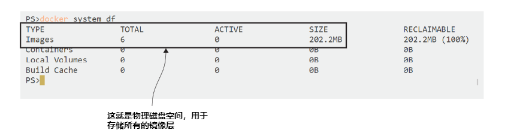
<center>图3.10 </center>

You can see in figure 3.10 that my image cache is actually using 202.2 MB, meaning
163 MB of image layers are being shared between images, a 45% saving on disk space.
The amount of disk space you save through reuse is typically much larger when you
have a large number of application images all sharing the same base layers for the run-
time. Those base layers might have Java, .NET Core, PHP—whatever technology stack
you use, Docker’s behavior is the same.

One last piece of theory. If image layers are shared around, they can’t be edited—
otherwise a change in one image would cascade to all the other images that share the
changed layer. Docker enforces that by making image layers read-only. Once you cre-
ate a layer by building an image, that layer can be shared by other images, but it can’t
be changed. You can take advantage of that to make your Docker images smaller and
your builds faster by optimizing your Dockerfiles.

## 3.5 优化 Dockerfile 使用镜像缓存层

There’s a layer of your web-ping image that contains the application’s JavaScript file.
If you make a change to that file and rebuild your image, you’ll get a new image layer.
Docker assumes the layers in a Docker image follow a defined sequence, so if you
change a layer in the middle of that sequence, Docker doesn’t assume it can reuse the
later layers in the sequence.

TRY IT NOW
Make a change to the app.js file in the ch03-web-ping direc-
tory. It doesn’t have to be a code change; just adding a new empty line at the
end of the file will do. Then build a new version of your Docker image:
docker image build -t web-ping:v2 .

You’ll see the same output as mine in figure 3.11. Steps 2 through 5 of the build use
layers from the cache, and steps 6 and 7 generate new layers.

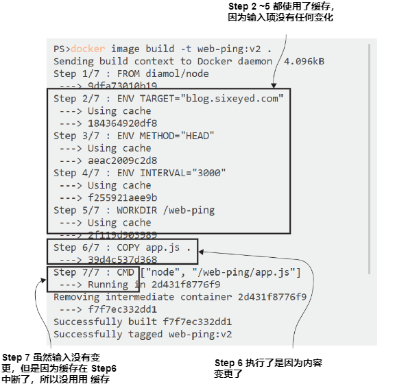
<center>图3.11 </center>

Every Dockerfile instruction results in an image layer, but if the instruction doesn’t
change between builds, and the content going into the instruction is the same,
Docker knows it can use the previous layer in the cache. That saves executing the
Dockerfile instruction again and generating a duplicate layer. The input is the same,
so the output will be the same, so Docker can use what’s already there in the cache.

Docker calculates whether the input has a match in the cache by generating a
hash, which is like a digital fingerprint representing the input. The hash is made from
the Dockerfile instruction and the contents of any files being copied. If there’s no
match for the hash in the existing image layers, Docker executes the instruction, and
that breaks the cache. As soon as the cache is broken, Docker executes all the instruc-
tions that follow, even if they haven’t changed.

That has an impact even in this small example image. The app.js file has changed
since the last build, so the COPY instruction in step 6 needs to run. The CMD instruction
in step 7 is the same as the last build, but because the cache was broken at step 6, that
instruction runs as well.

Any Dockerfile you write should be optimized so that the instructions are ordered
by how frequently they change—with instructions that are unlikely to change at the
start of the Dockerfile, and instructions most likely to change at the end. The goal is
for most builds to only need to execute the last instruction, using the cache for
everything else. That saves time, disk space, and network bandwidth when you start
sharing your images.

There are only seven instructions in the web-ping Dockerfile, but it can still be
optimized. The CMD instruction doesn’t need to be at the end of the Dockerfile; it can
be anywhere after the FROM instruction and still have the same result. It’s unlikely to
change, so you can move it nearer the top. And one ENV instruction can be used to set
multiple environment variables, so the three separate ENV instructions can be com-
bined. The optimized Dockerfile is shown in listing 3.2.

> Listing 3.2 The optimized web-ping Dockerfile

```
FROM diamol/node
CMD ["node", "/web-ping/app.js"]
ENV TARGET="blog.sixeyed.com" \
METHOD="HEAD" \
INTERVAL="3000"
WORKDIR /web-ping
COPY app.js .
```

TRY IT NOW
The optimized Dockerfile is in the source code for this chapter
too. Switch to the web-ping-optimized folder and build the image from the
new Dockerfile:
cd ../web-ping-optimized
docker image build -t web-ping:v3 .

You won’t notice too much difference from the previous build. There are now five
steps instead of seven, but the end result is the same—you can run a container from
this image, and it behaves just like the other versions. But now if you change the appli-
cation code in app.js and rebuild, all the steps come from the cache except the final
one, which is exactly what you want, because that’s all you’ve changed.

That’s all for building images in this chapter. You’ve seen the Dockerfile syntax
and the key instructions you need to know, and you’ve learned how to build and work
with images from the Docker CLI.

There are two more important things to take from this chapter, which will be of
good service to you in every image you build: optimize your Dockerfiles, and make
sure your image is portable so you use the same image when you deploy to different
environments. That really just means you should take care how you structure your
Dockerfile instructions, and make sure the application can read configuration values
from the container. It means you can build images quickly, and when you deploy to
production you’re using the exact same image that was quality-approved in your test
environments.

## 3.6 实验室

Okay, it’s lab time. The goal here is to answer this question: how do you produce a
Docker image without a Dockerfile? The Dockerfile is there to automate the deploy-
ment of your app, but you can’t always automate everything. Sometimes you need to run
the application and finish off some steps manually, and those steps can’t be scripted.

This lab is a much simpler version of that. You’re going to start with an image on
Docker Hub: diamol/ch03-lab. That image has a file at the path /diamol/ch03.txt.
You need to update that text file and add your name at the end. Then produce your
own image with your changed file. You’re not allowed to use a Dockerfile.

There’s a sample solution on the book’s GitHub repository if you need it. You’ll
find it here: https://github.com/sixeyed/diamol/tree/master/ch03/lab.
Here are some hints to get you going:
- Remember that the -it flags let you run to a container interactively.
- The filesystem for a container still exists when it is exited.
- There are lots of commands you haven’t used yet. docker container --help
  will show you two that could help you solve the lab.