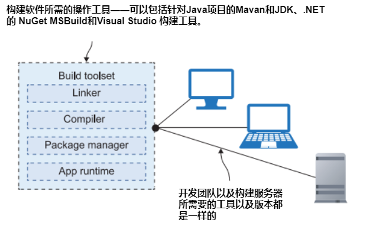
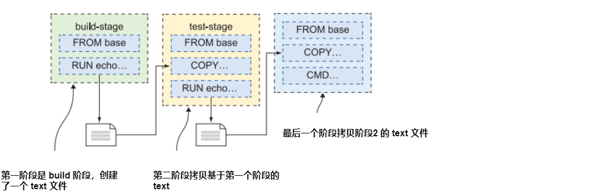
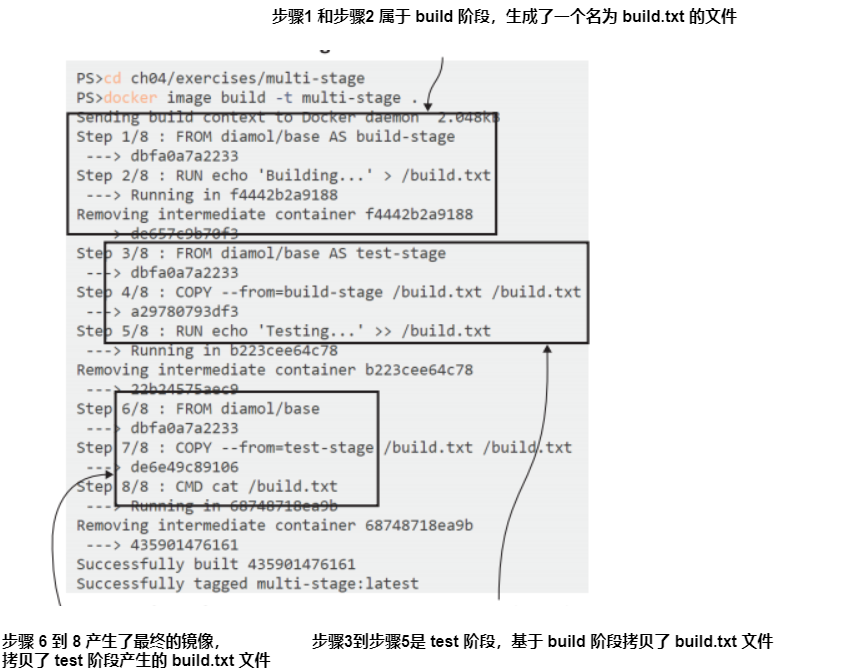
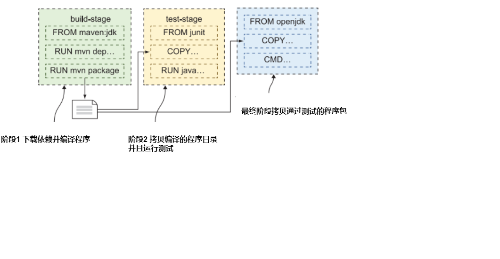
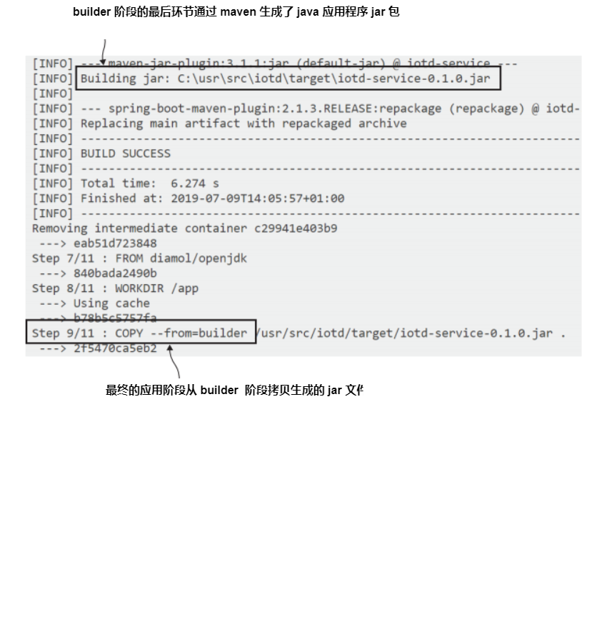
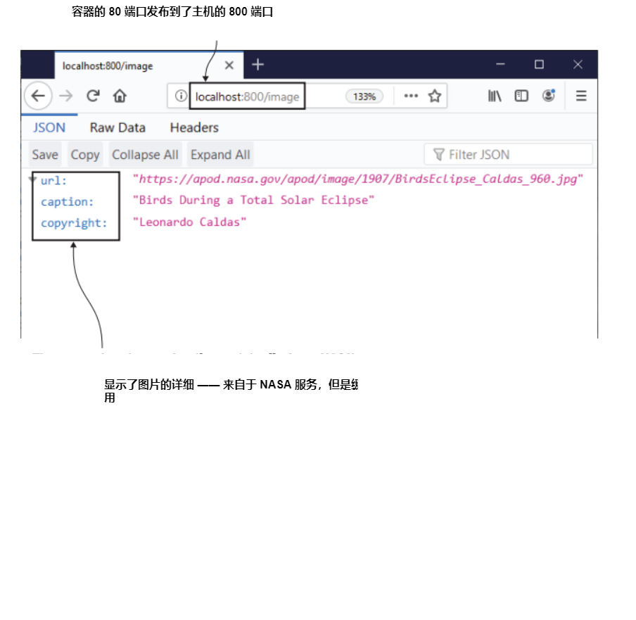
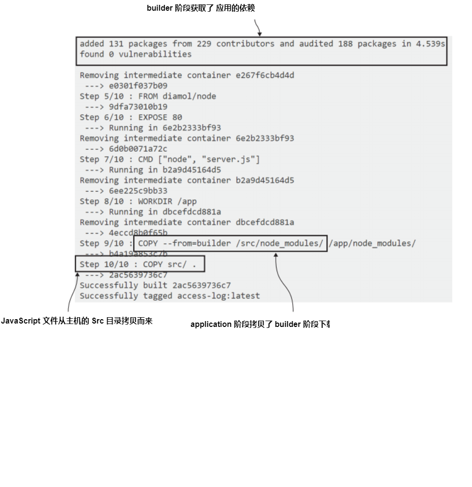
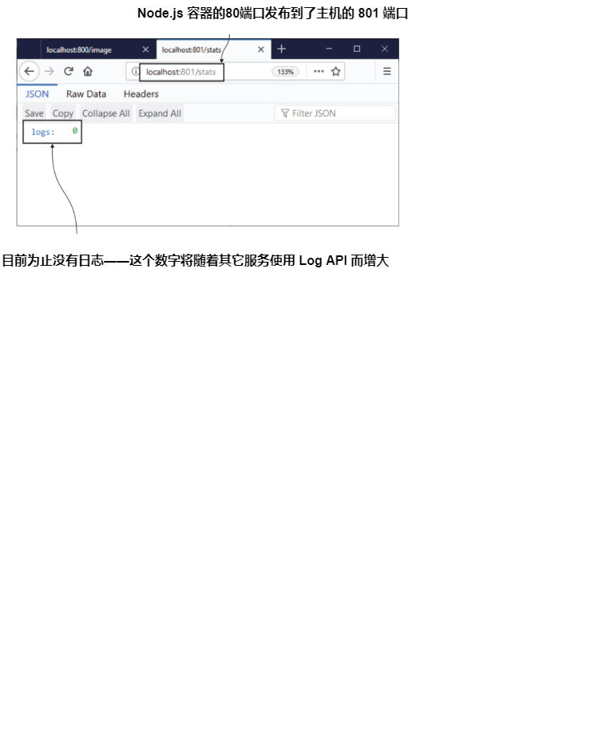
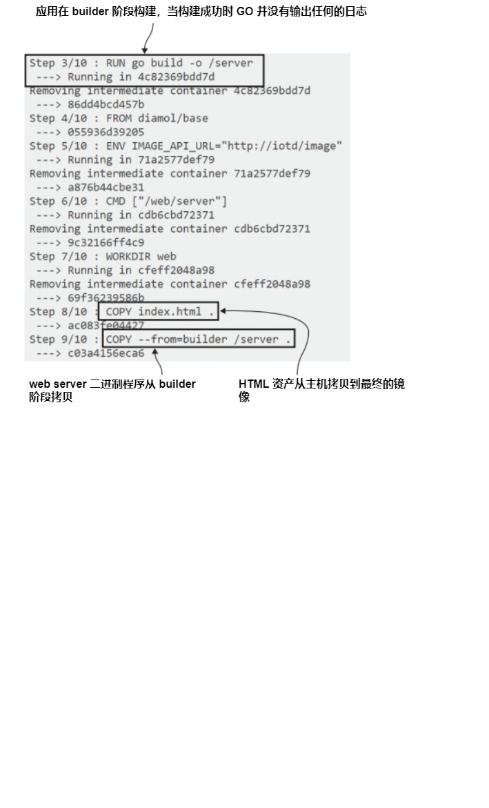

# 第四章 将应用程序源码打包到镜像中

构建 Docker 镜像非常简单，在第三章你已经学会了仅仅需要在 Dockerfile 中定义一些信息你就可以打包应用程序并在容器中运行。关于打包你自己的应用程序还有另外一件事情你需要知道：你同样可以在 Dockerfiles 中运行命令。

构建过程中执行的命令以及基于这些命令产生的任何文件系统的变更都被保存在了镜像层。这使得 Dockerfile 成为最具扩展性的打包格式；你可以解压 zip 文件，运行 windows 安装程序以及任何其他诸如此类的事情。在本章，你将使用此扩展性来基于你的源代码打包应用程序。

## 4.1 有了 Dockerfile 谁还需要构建服务器

在你的笔记本构建软件是你为本地开发环境做的事情，但是当你在一个团队中工作，会有一个更严格的交付过程。将会有一个像 GitHub 的源代码控制系统，要求大家推送他们的代码变更，通常当构建的软件包含一些变更的推送，将有一个单独的服务器(或在线服务)来执行构建。

这个过程的存在是为了及早发现问题。如果开发人员忘记添加文件。当他们推送代码时，构建服务器上的构建将失败，团队将收到警报。它使项目保持健康，但成本是必须维护构建服务器。大多数编程语言需要很多工具来构建项目--如图4.1所示的一些例子。


<center>图4.1 </center>

这里有很大的维护开销。团队的新成员会花费一整体来安装工具。如果开发人员更新了他们的本地工具，而构建服务器正在运行不同的版本，构建可能会失败。你即使使用的是托管服务器来构建服务，也会出现同样的问题。

如果一次性打包构建工具集并将其共享，就会干净得多，你可以用 Docker 做什么。您可以编写 Dockerfile 脚本部署所有的工具，并将其构建到一个镜像中，然后你就可以用它了，在你的应用程序Dockerfiles中编译源代码，并最终输出的是打包的应用程序。

让我们从一个非常简单的例子开始，因为有一些新的东西用来了解这个过程。

> 清单 4.1 显示了具有基本工作流的 Dockerfile

```
FROM diamol/base AS build-stage
RUN echo 'Building...' > /build.txt
FROM diamol/base AS test-stage
COPY --from=build-stage /build.txt /build.txt
RUN echo 'Testing...' >> /build.txt
FROM diamol/base
COPY --from=test-stage /build.txt /build.txt
CMD cat /build.txt
```

这被称作多阶段 Dockerfile，因为针对构建存在几个阶段。每个阶段都以 FROM 指令开始，然后你可以可选的通过 AS 参数给予阶段一个名字。清单 4.1 有三个阶段：build-state、test-stage 以及最后一个未命名的 stage。尽管有多个阶段，但是输出将会是包含最后一个阶段内容的镜像。

每个阶段都独立运行，但您可以从以前的阶段复制文件和目录。我将COPY指令与--from参数一起使用，它告诉 Docker 从Dockerfile的早期阶段复制文件，而不是从
主机。在本例中，我在 build-stage 生成一个文件，并将其复制到 test-stage，然后将文件从 test-stage 复制到最终阶段。

这里有一个新的指令，RUN，我正在用它来写文件。RUN 指令在构建期间在容器内执行命令，该命令的任何输出都保存在镜像层中。您可以在 RUN指令中执行任何动作，但要运行的命令需要存在于FROM指令 使用的镜像中。在本例中，我使用了diamol/base作为基础图像，它包含echo命令，所以我知道 RUN 指令会起作用。

图 4.2 显示了当我们构建这个 Dockerfile时会发生什么： Docker将依次运行阶段。


<center>图4.2 </center>

重要的是要了解各个阶段是孤立的。您可以在安装了不同工具集的情况下使用不同的基础镜像，并运行您喜欢的任何命令。最后阶段的输出将只包含从早期阶段显式复制的内容。如果命令在任何阶段失败，整个构建都会失败。

<b>现在就试试</b> 打开会话终端进入到本书的源代码目录, 构建多阶段 Dockerfile:

```
cd ch04/exercises/multi-stage
docker image build -t multi-stage .
```

你将会看到构建按照 Dockerfile 的顺序步骤执行，你可以看到图 4.3 类似的输出。


<center>图4.3 </center>

这是一个简单的例子，但是和复杂应用的模式是一样的，都是通过单个 Dockerfile 构建。图 4.4 是构建Java 应用程序的例子。


<center>图4.4 </center>

在 build 阶段，你使用了一个基础镜像，该镜像安装了你应用构建时所需的工具。你拷贝你主机上的源代码并允许构建命令。你可以添加一个 test 阶段以运行单元测试，该单元测试使用了一个包含已安装的测试框架的基础镜像，拷贝 build 阶段编译产生的二进制文件并运行测试。而最终的 final 阶段仅仅从包含了应用运行时的基础镜像开始，然后它拷贝 build 阶段产生的经过 test 阶段成功测试的二进制文件。

这种方法使您的应用程序真正可移植。你可以在任何地方的容器中运行应用，但你也可以在任何地方构建应用——docker是唯一的先决条件。你的构建服务器只需要安装Docker;新的团队成员开始工作在几分钟内，构建工具都集中在 Docker 镜像中，所以没有不同步的几率。

所有主流的应用程序框架都已经在 Docker Hub 上有了安装了构建工具的公共镜像，相关应用程序运行时有单独的镜像。您可以直接使用这些镜像，也可以将它们包装在自己的镜像中。你会得到使用由项目团队维护的镜像的所有最新更新的好处。

## 4.2 应用演练：Java 源代码

现在我们将转向一个真实的示例，使用一个简单的 Java Spring Boot 应用程序,我们将使用 Docker 构建和运行它。你不需要是Java开发人员或者在你的机器上安装Java工具来使用这个应用程序;你需要的一切都会来自于 Docker 镜像中。如果你不使用Java，你仍然应该阅读这篇章节——它描述了一种适用于其他编译语言(如.net和Erlang)的模式。

源代码位于该书的存储库中，文件夹路径为 ch04/exercises/image-of-the]-day。该应用程序使用一组相当标准的工具 Java: Maven，用于定义构建过程和获取依赖项 以及 OpenJDK，这是一个可自由分发的Java运行时和开发工具包。Maven 使用一种描述构建的XML格式，Maven命令行称为mvn。这些信息应该足以理解清单4.2 Dockerfile 所构建的应用程序。

> 清单 4.2 Dockerfile 通过 maven 构建 Java 应用

```
FROM diamol/maven AS builder
WORKDIR /usr/src/iotd
COPY pom.xml .
RUN mvn -B dependency:go-offline
COPY . .
RUN mvn package
# app
FROM diamol/openjdk
WORKDIR /app
COPY --from=builder /usr/src/iotd/target/iotd-service-0.1.0.jar .
EXPOSE 80
ENTRYPOINT ["java", "-jar", "/app/iotd-service-0.1.0.jar"]
```

基本上该清单中所有的 Dockerfile 指令在之前都碰到过，并且模式和之前构建的例子都很类似。你可以知道这是一个多阶段构建的 Dockerfile，，因为有不止一条From 指令，并且这些步骤是为了从 Docker 的镜像层缓存中获得最大的好处。

第一阶段被称为 builder 阶段。下面是在 builder 阶段发生的事情:
- 它使用 diamol/maven 镜像作为基础。该映像包含已安装的 OpenJDK Java 开发工具包，以及 Maven 构建工具。
- builder 阶段首先在镜像中创建一个工作目录，然后复制 pom.xml 文件，这是 Java 构建的 Maven 定义文件。
- 第一个 RUN 语句执行 Maven 命令，获取所有应用程序依赖项。这是一项昂贵的步骤，所以它有自己的步骤利用Docker层缓存。如果有新的依赖项，则XML文件
将改变，步骤将运行。如果依赖项没有更改，则使用层缓存。
- 接下来剩余的源代码复制在：copy . . 表示“从Docker构建运行的位置复制所有文件和目录到镜像中的工作目录”。
- builder 的最后一步是运行mvn package，它编译和打包应用程序。输入是一组Java源代码文件，输出是一个 Java 应用程序包:称为JAR文件。

当此阶段完成时，已编译的应用程序将存在于 builder 阶段的文件系统。如果 Maven 构建有任何问题—如果网络脱机并且获取依赖项失败，或者源中存在编码错误
RUN 指令将失败，整个构建将失败。

如果 builder 阶段成功完成，Docker将继续执行最终阶段，生成应用程序镜像:

- 这从diamol/openjdk开始，它用Java 11运行时打包，但没有Maven构建工具。
- 此阶段创建一个工作目录，并从 builder 阶段复制已编译的JAR文件。 Maven将应用程序和其所有Java依赖项打包在单个JAR文件中，因此这是构建器所需的一切。
- 该应用程序是一个监听端口 80 端口的Web服务器，因此在 EXPOSE 指令中明确列出该端口，告诉 Docker 该端口可以发布。
- ENTRYPOINT 指令是 CMD 指令的替代方法 - 它告诉 Docker，当从镜像启动容器时要执行什么操作，在这种情况下运行JAR的路径下的 Java 应用程序。

<b>现在就试试</b> 进入 Java 应用目录构建镜像:

```
cd ch04/exercises/image-of-the-day
docker image build -t image-of-the-day
```

你将会看到构建时很多的输出，因为 maven 构建获取依赖产生了大量日志，图 4.5 显示了我构建时的输出。


<center>图4.5 </center>

你刚刚构建的是什么？它是一个简单的 REST API，封装了对 NASA 每日天文图片服务的访问(https://apod.nasa.gov)。这个 Java 应用获取了今天 NASA 的图片并缓存了下来，这样子你就无需频繁访问 NASA 服务。

Java API 只是本章将要运行的完整应用程序的一部分 - 实际上它将使用多个容器，并且它们需要相互通信。 容器通过虚拟网络相互访问，使用Docker在创建容器时分配的虚拟IP地址。 您可以通过命令行创建和管理虚拟Docker网络。

<b>现在就试试</b> 创建容器虚拟网络与其它容器通信:

`docker network create nat`

如果您从该命令中看到错误，那是因为您的设置已经有一个名为 nat 的 Docker 网络，因此您可以忽略该消息。现在，当您运行容器时，您可以使用--network 标志显式地将容器连接到该Docker网络，并且该网络上的任何容器都可以使用容器名称相互访问。

<b>现在就试试</b> 从镜像运行容器，将端口 80 发布到主机计算机，并连接到 nat 网络：

`docker container run --name iotd -d -p 800:80 --network nat image-of-the-day`

现在，您可以浏览http://localhost:800/image，并看到有关 NASA 今日图像的一些 JSON 详细信息。在我运行容器的那天，该图像来自日全食-图4.6显示了我的API的详细信息。


<center>图4.6 </center>

容器中的实际应用程序并不重要（但不要立即删除它-我们将在本章后面使用它）。重要的是，只需拥有带有Dockerfile的源代码的副本，就可以在安装了Docker的任何机器上构建它。您不需要安装任何构建工具，也不需要特定版本的Java-只需克隆代码库，然后再运行几个Docker命令就可以运行应用程序。

请注意，构建工具不是最终应用程序镜像的一部分。您可以从新的 image-of-the-day 镜像运行交互式容器，并发现其中没有 mvn 命令。 Dockerfile 中的最终阶段中的内容才会制成应用程序镜像；您需要从以前一个阶段复制的任何内容都需要在最终阶段明确复制。

## 4.3 应用演练：Node.js 源代码

我们将继续通过另一个多阶段 Dockerfile，这次是用于 Node.js 应用程序。组织越来越多地使用不同的技术栈，因此了解不同构建在 Docker 中的样子是很有用的。Node.js 是一个很好的选择，因为它很受欢迎，而且还是另一种构建类型的例子 - 这种模式也适用于 Python，PHP 和 Ruby 等脚本语言。此应用程序的源代码位于 ch04/exercises/access-log 文件夹路径中。

Java 应用程序是需要编译的，因此源代码会被复制到构建阶段，并生成一个 JAR 文件。JAR 文件是编译的应用程序包，它被复制到最终的应用程序镜像中，但源代码不需要。.NET Core 是一样的，其中编译的工件是 DLL（动态链接库）。Node.js 不同 - 它使用 JavaScript，这是一种解释型语言，因此没有编译步骤。使用 Docker 的 Node.js 应用程序需要 Node.js 运行时和应用程序镜像中的源代码。

还是需要多阶段 Dockerfile：它优化了依赖项加载。Node.js 使用名为 npm 的工具（Node 包管理器）来管理依赖项。列表 4.3 显示了本章 Node.js 应用程序的完整 Dockerfile。

> 清单 4.3 构建 npm Node.js 应用的 Dockerfile

```
FROM diamol/node AS builder
WORKDIR /src
COPY src/package.json .
RUN npm install
# app
FROM diamol/node
EXPOSE 80
CMD ["node", "server.js"]
WORKDIR /app
COPY --from=builder /src/node_modules/ /app/node_modules/
COPY src/ .
```

这里的目标与 Java 应用程序相同 - 只安装 Docker 即可打包和运行应用程序，而无需安装其他任何工具。两个阶段的基础镜像都是 diamol/node，其中包含 Node.js 运行时和 npm。Dockerfile 中的构建器阶段复制了 package.json 文件，该文件描述了所有应用程序的依赖项。然后它运行 npm install 下载依赖项。没有编译，因此这些就是它需要做的了。

这个应用程序是另一个 REST API。在最终的应用程序阶段，步骤公开 HTTP 端口并指定 node 命令行作为启动命令。最后一件事是创建一个工作目录并复制应用程序工件。下载的依赖项从构建器阶段复制，源代码从主机计算机复制。src 文件夹包含 JavaScript 文件，包括 server.js，它是由 Node.js 进程启动的入口点。

我们这里有一个不同的技术栈，采用了不同的应用程序打包模式。Node.js 应用程序的基础镜像，工具和命令都与 Java 应用程序不同，但这些差异都被捕获在 Dockerfile 中。构建和运行应用程序的过程完全相同。

<b>现在就试试</b> 浏览 Node.js 应用程序源代码并构建镜像：

```
cd ch04/exercises/access-log
docker image build -t access-log .
```

您会看到来自 npm 的大量输出（这也可能显示一些错误和警告消息，但您可以忽略这些）。图 4.7 显示了我构建的部分输出。下载的包被保存在 Docker 镜像层缓存中，因此如果您在工作中仅进行代码更改，则下一次运行的构建将非常快。


<center>图4.7 </center>

您刚刚构建的 Node.js 应用程序根本没有意思，但您仍应该运行它以检查打包是否正确。它是一个 REST API，其他服务可以调用它来写日志。有一个用于记录新日志的 HTTP POST 端点，还有一个 GET 端点，显示已记录的日志数。

<b>现在就试试</b>从 log API 镜像运行容器，将端口 80 发布到主机并将其连接到相同的 nat 网络：


`docker container run --name accesslog -d -p 801:80 --network nat access-log`

现在浏览 http://localhost:801/stats，您将看到服务记录了多少日志。图 4.8 显示我迄今为止没有日志 - Firefox 很好地格式化了 API 响应，但您在其他浏览器中可能会看到原始 JSON。


<center>图4.8 </center>

The log API is running in Node.js version 10.16, but just like with the Java example,you don’t need any versions of Node.js or any other tools installed to build and run
this app. The workflow in this Dockerfile downloads dependencies and then copies the script files into the final image. You can use the exact same approach with Python,using Pip for dependencies, or Ruby using Gems.
日志 API 正在运行 Node.js 版本 10.16，但就像 Java 示例一样，您无需安装任何版本的 Node.js 或其他工具即可构建和运行此应用程序。该 Dockerfile 中的工作流下载依赖项，然后将脚本文件复制到最终镜像中。您可以使用与 Python 相同的方法，使用 Pip 获取依赖项，或 Ruby 所使用的 Gems。

## 4.4 应用演练：Go 源代码

我们最后一个例子是用 Go 编写的 web 应用程序的多阶段 Dockerfile。Go 是一种现代的跨平台语言，可编译为本地二进制文件。这意味着您可以编译应用程序以在任何平台（Windows、Linux、Intel或Arm）上运行，编译后的输出就是完整的应用程序。您不需要像Java、.NET Core、Node.js 或者 Python 那样安装单独的运行时，这使得 Docker 镜像非常小。

还有一些其他语言也可以编译成原生二进制文件。Rust和Swift很流行，但Go具有最广泛的平台支持，它也是云原生应用程序非常流行的语言（Docker本身是用Go编写的）。在Docker中构建Go应用程序意味着使用与Java应用程序类似的多阶段 Dockerfile 方法，但有一些重要的区别。清单 4.4 显示了完整的Dockerfile。

```
FROM diamol/golang AS builder

COPY main.go .
RUN go build -o /server

# app
FROM diamol/base

ENV IMAGE_API_URL="http://iotd/image" \
    ACCESS_API_URL="http://accesslog/access-log"
CMD ["/web/server"]

WORKDIR web
COPY index.html .
COPY --from=builder /server .
RUN chmod +x server
```

Go 编译为本地二进制文件，因此 Dockerfile 中的每个阶段都使用不同的基本镜像。builder 阶段使用 diamol/golang，它安装了所有Go工具。Go应用程序通常不获取依赖项，因此这个阶段直接构建应用程序（它只是一个代码文件 main.go）。最后的应用程序阶段使用一个最小的镜像，它只有最小的操作系统工具层，称为 diamol/base。

Dockerfile 捕获一些配置设置作为环境变量，并将启动命令指定为编译的二进制文件。应用程序阶段结束时，从主机复制应用程序提供的 HTML文件，并从 builder 阶段复制 web 服务器二进制文件。二进制文件需要在Linux中明确标记为可执行，这就是最后的chmod命令所做的（这对Windows没有影响）。

<b>现在就试试</b> 浏览 Go 应用程序源代码并构建镜像：

```
cd ch04/exercises/image-gallery
docker image build -t image-gallery .
```

这次不会有太多编译器输出，因为Go是安静的，只输出故障时记录。您可以在图4.9中看到我的简短输出。


<center>图4.9 </center>

这个 Go 应用程序确实做了一些有用的事情，但在您运行它之前，它是值得的看看进出的镜像的大小。

<b>现在就试试</b> 将 Go 应用程序镜像大小与 Go 工具集镜像进行比较：

`docker image ls -f reference=diamol/golang -f reference=image-gallery`

Many Docker commands let you filter the output. This command lists all images and
filters the output to only include images with a reference of diamol/golang or image-
gallery—the reference is really just the image name. When you run this, you’ll see
how important it is to choose the right base images for your Dockerfile stages:
```
REPOSITORY TAG IMAGE ID CREATED SIZE
image-gallery latest b41869f5d153 20 minutes ago 25.3MB
diamol/golang latest ad57f5c226fc 2 hours ago 774MB
```

On Linux, the image with all the Go tools installed comes in at over 770 MB; the
actual Go application image is only 25 MB. Remember, that’s the virtual image size, so
a lot of those layers can be shared between different images. The important saving
isn’t so much the disk space, but all the software that isn’t in the final image. The
application doesn’t need any of the Go tools at runtime. By using a minimal base
image for the application, we’re saving nearly 750 MB of software, which is a huge
reduction in the surface area for potential attacks.

Now you can run the app. This ties together your work in this chapter, because the
Go application actually uses the APIs from the other applications you’ve built. You
should make sure you have those containers running, with the correct names from
the earlier try-it-now exercises. If you run docker container ls, you should see two
containers from this chapter—the Node.js container called accesslog and the Java
container called iotd. When you run the Go container, it will use the APIs from the
other containers.

TRY IT NOW Run the Go application image, publishing the host port and connecting to the nat network:

`docker container run -d -p 802:80 --network nat image-gallery`

You can browse to http:/ /localhost:802 and you’ll see NASA’s Astronomy Picture of
the Day. Figure 4.10 shows the image when I ran my containers.


<center>图4.10 </center>

Right now you’re running a distributed application across three containers. The Go
web application calls the Java API to get details of the image to show, and then it calls
the Node.js API to log that the site has been accessed. You didn’t need to install any
tools for any of those languages to build and run all the apps; you just needed the
source code and Docker.

Multi-stage Dockerfiles make your project entirely portable. You might use Jenkins
to build your apps right now, but you could try AppVeyor’s managed CI service or
Azure DevOps without having to write any new pipeline code—they all support
Docker, so your pipeline is just docker image build.


## 4.5 理解 Dockerfile 的多阶段构建

在本章中，我们已经介绍了很多内容，我将以一些关键内容结束，至此，你已经非常清楚多阶段 Dockerfile 是如何工作的，以及为什么它在容器中构建应用程序非常有用。

第一点是关于标准化。我知道你做本章的练习时将会成功运行，因为你和我使用的工具都是一样的。无论您使用什么操作系统，所有构建都在Docker容器中运行，并且容器镜像具有所有正确版本的工具。在您的实际项目中，您会发现这大大简化了新开发人员的入职，降低构建服务器的维护负担，并消除因为用户具有不同版本的工具而造成损坏的可能性。

第二点是性能。多级构建中的每个阶段都有自己的缓存。Docker 在镜像层缓存中查找每个指令的匹配项；如果找不到，缓存将被破坏，所有其余的指令将被执行，但仅限于该阶段。下一阶段再次从缓存开始。您将花费时间仔细构建Dockerfile，当您完成优化后，您将发现 90% 的构建步骤都使用缓存。

最后一点是，多阶段 Dockerfile 允许您对构建进行微调，从而使最终的应用程序镜像尽可能精简。这不仅适用于编译器，您需要的任何工具都可以在早期阶段被隔离，因此工具本身不会出现在最终镜像中。一个很好的例子是curl，这是一个流行的命令行工具，可以用于从互联网下载内容。您可能需要下载应用程序所需的文件，但您可以在 Dockerfile 的早期阶段这样做，这样curl本身就不会安装在应用程序镜像中。这样可以减小镜像大小，这意味着启动时间更快，但这也意味着应用程序镜像中可用的软件更少，这也意味着攻击者的潜在攻击更少。

## 4.6 实验室   

实验时间！您将实践您学到的关于多阶段构建和优化 Dockerfile 的知识。在本书的源代码中，您会发现在 ch04/lab文件夹中是您的起点。这是一个简单的Go Web服务器应用程序，已经有一个Dockerfile，因此您可以在Docker中构建和运行它。但是Dockerfile需要优化，这是您的工作。

实验的具体目标是：

- 首先使用现有的 Dockerfile 构建镜像，然后优化 Dockerfile 以生成新镜像。
- 目前的镜像在Linux上是800 MB，在Windows上是5.2 GB。您的优化镜像应该在Linux上约为15 MB或在Windows上约为260 MB。
- 如果使用当前的Dockerfile更改HTML内容，则构建会执行七个步骤。
- 您的优化的 Dockerfile 应该只执行一个步骤，当您更改HTML时。

As always, there’s a sample solution on the book’s GitHub repository. But this is one
lab you should really try and find time to do, because optimizing Dockerfiles is a valu-
able skill you’ll use in every project. If you need it, though, my solution is here:
https://github.com/sixeyed/diamol/blob/master/ch04/lab/Dockerfile.optimized.

与往常一样，本书的 GitHub 存储库中有一个示例解决方案。但是，这是一个您应该真正尝试找时间去做的实验，因为优化 Dockerfile 是一种宝贵的技能，您将在每个项目中使用它。但是，如果您需要，我的解决方案在这里：https://github.com/yyong-brs/learn-docker/tree/master/diamol/ch04/lab/Dockerfile.optimized。
