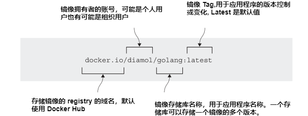
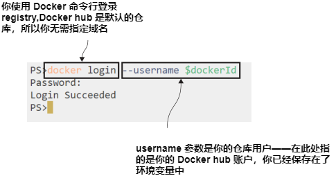
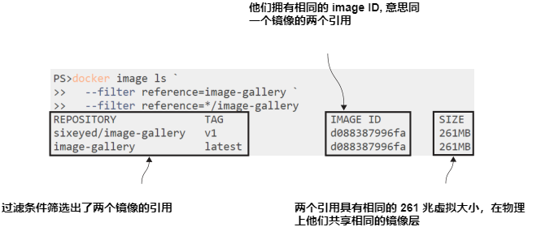
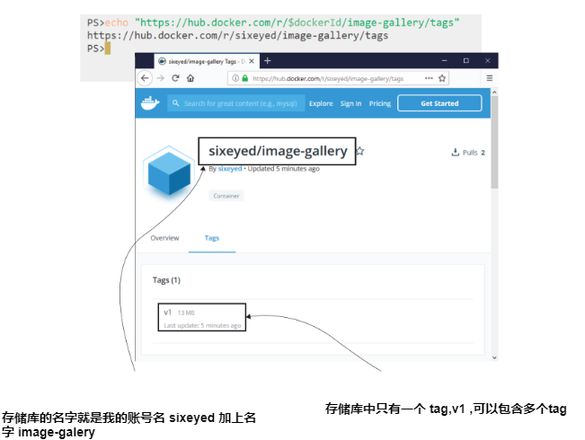
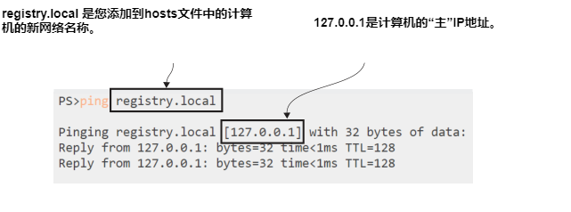
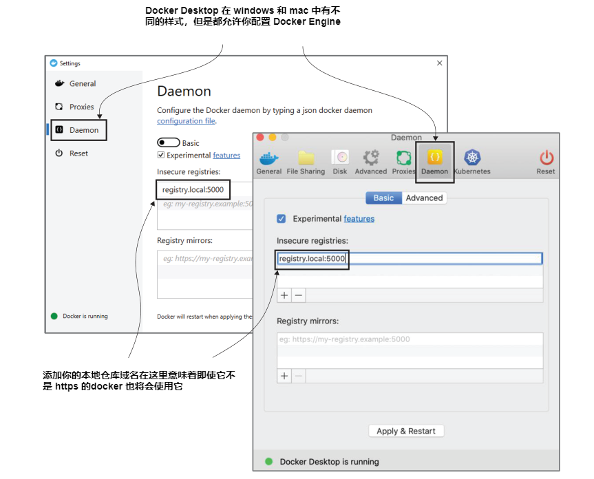
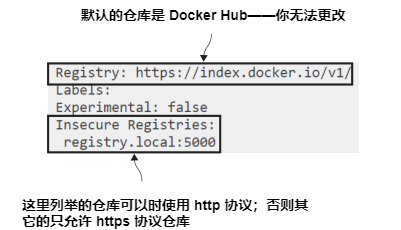
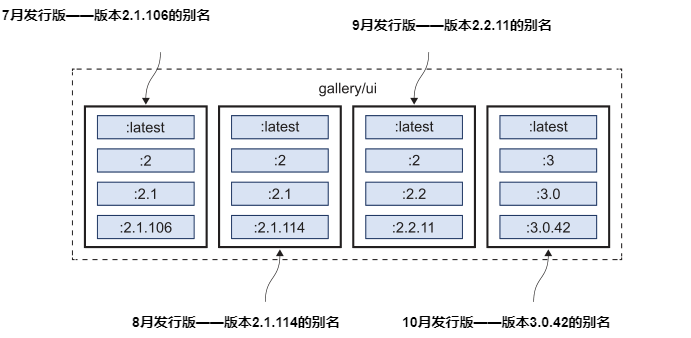

# 第五章 通过 Docker Hub 及其它仓库共享镜像

You’ve spent the last few chapters getting a good understanding of the build and run parts of the Docker workflow—now it’s time for share. Sharing is all about taking the images you’ve built on your local machine and making them available for other people to use. I really think this is the most important part of the Docker equation. Packaging your software along with all its dependencies means anyone can use it easily, on any machine—there are no gaps between environments, so there are no more days wasted setting up software or tracking down bugs that are actually deployment problems.

## 5.1 使用 registry、repository 以及镜像 Tag

Software distribution is built into the Docker platform. You’ve already seen that you can run a container from an image, and if you don’t have that image locally,Docker will download it. The server that stores images centrally is called a Docker registry. Docker Hub is the most popular image registry, hosting hundreds of thousands of images, which are downloaded billions of times every month. It’s also the default registry for the Docker Engine, which means it’s the first place Docker looks for images that aren’t available locally.

Docker images need a name, and that name contains enough information for Docker to find the exact image you’re looking for. So far we’ve used very simple names with one or two parts, like image-gallery or diamol/golang. There are actually four parts to a full image name (which is properly called the image refer-ence). Figure 5.1 shows all those parts in the full reference for diamol/golang:


<center>图5.1 解剖 Docker 镜像引用</center>

You’ll be making use of all the parts of an image reference when you start managing your own application images. On your local machine you can name images anything you like, but when you want to share them on a registry, you’ll need to add some more details, because the image reference is a unique identifier for one specific image on a registry.

Docker uses a couple of defaults if you don’t provide values for parts of the image reference. The default registry is Docker Hub, and the default tag is latest. Docker Hub’s domain is docker.io so my image, diamol/golang, is a short version of docker.io/diamol/golang:latest. You can use either of those references. The diamol account is an organization on Docker Hub, and golang is a repository within that organization. It’s a public repository, so anyone can pull the image, but you need to be a member of the diamol organization to push images.

Large companies usually have their own Docker registry in their own cloud environment or their local network. You target your own registry by including the domain name in the first part of the reference, so Docker knows not to use Docker Hub. If I hosted my own registry at r.sixeyed.com, my image could be stored at r.sixeyed.com/diamol/golang. That’s all pretty simple, but the most important part of the image reference is the tag.

You haven’t used image tags so far because it’s simpler to get started without them, but when you start building your own application images, you should always tag them. Tags are used to identify different versions of the same application. The official Docker OpenJDK image has hundreds of tags—openjdk:13 is the latest release, openjdk:8u212-jdk is a specific release of Java 8, and there are more for different Linux distributions and Windows versions. If you don’t specify a tag when you create an image, Docker uses the default tag latest. That's a misleading name,because the image tagged “latest” might not actually be the most recent image version. When you push your own images, you should always tag them with explicit versions.

## 5.2 推送你自己的镜像到 Docker Hub

We’ll get started by pushing one of the images you built in chapter 4 up to Docker Hub. You’ll need a Docker Hub account for that—if you don’t have one, browse to https://hub.docker.com and follow the link to sign up for an account (it’s free and it won’t get you a ton of spam in your inbox).

You need to do two things to push an image to a registry. First you need to log in to the registry with the Docker command line, so Docker can check that your user account is authorized to push images. Then you need to give your image a reference that includes the name of an account where you have permission to push.

Every reader will have their own Docker Hub username, so to make it easier to follow along with the exercises, let’s start by capturing your own Docker ID in a variable in your terminal session. After this, you’ll be able to copy and paste the rest of this chapter’s commands.

TRY IT NOW
Open a terminal session and save your Docker Hub ID in a variable. Your Docker ID is your username, not your email address. This is one command that is different on Windows and Linux, so you’ll need to choose the right option:

```
# using PowerShell on Windows
$dockerId="<your-docker-id-goes-here>"
# using Bash on Linux or Mac
export dockerId="<your-docker-id-goes-here>"
```

I’m running Windows at the moment, and my Docker Hub username is sixeyed, so the command I run is $dockerId="sixeyed"; on Linux I would run dockerId="sixeyed".On any system, you can run echo $dockerId and you should see your username displayed. From now on, you can copy the commands in the exercises and they’ll use your Docker ID.

Start by logging in to Docker Hub. It’s actually the Docker Engine that pushes and pulls images, but you authenticate using the Docker command line—when you run the login command, it will ask for your password, which is your Docker Hub password.

TRY IT NOW
Log in to Docker Hub. Hub is the default registry, so you don’t need to specify a domain name:

`docker login --username $dockerId`

You’ll see output like mine in figure 5.2—sensibly, Docker doesn’t show the password when you type it in.


<center>图5.2 登录 Docker Hub</center>

Now that you’re logged in, you can push images to your own account or to any organizations you have access to. I don’t know you, but if I wanted your help looking after the images for this book, I could add your account to the diamol organization, and you would be able to push images that start with diamol/. If you’re not a member of any organizations, you can only push images to repositories in your own account.

You built a Docker image called image-gallery in chapter 4. That image reference doesn’t have an account name, so you can’t push it to any registries. You don’t need to rebuild the image to give it a new reference though—images can have several references.

TRY IT NOW
Create a new reference for your existing image, tagging it as version 1:

`docker image tag image-gallery $dockerId/image-gallery:v1`

Now you have two references; one has an account and version number, but both references point to the same image. Images also have a unique ID, and you can see when you list them if a single image ID has multiple references.

TRY IT NOW
List the image-gallery image references:

`docker image ls --filter reference=image-gallery --filter reference='*/image-gallery'`

You’ll see similar output to mine in figure 5.3, except your tagged image will show your Docker Hub username instead of sixeyed.


<center>图5.3 一个镜像两个引用</center>

You now have an image reference with your Docker ID in the account name, and you’re logged in to Docker Hub, so you’re ready to share your image! The docker image push command is the counterpart of the pull command; it uploads your local image layers to the registry.

TRY IT NOW
List the image-gallery image references:

`docker image push $dockerId/image-gallery:v1`

Docker registries work at the level of image layers in the same way as the local Docker Engine. You push an image, but Docker actually uploads the image layers. In the output you’ll see a list of layer IDs and their upload progress. In my (abbreviated) output,you can see the layers being pushed:

```
The push refers to repository [docker.io/sixeyed/image-gallery]
c8c60e5dbe37: Pushed
2caab880bb11: Pushed
3fcd399f2c98: Pushed
...
v1: digest: sha256:127d0ed6f7a8d1... size: 2296
```

The fact that registries work with image layers is another reason why you need to spend time optimizing your Dockerfiles. Layers are only physically uploaded to the registry if there isn’t an existing match for that layer’s hash. It’s like your local Docker Engine cache, but applied across all images on the registry. If you optimize to the point where 90% of layers come from the cache when you build, 90% of those layers will already be in the registry when you push. Optimized Dockerfiles reduce build time, disk space, and network bandwidth.

You can browse to Docker Hub now and check your image. The Docker Hub UI uses the same repository name format as image references, so you can work out the URL of your image from your account name.

TRY IT NOW
This little script writes the URL to your image’s page on Docker Hub:

`echo "https://hub.docker.com/r/$dockerId/image-gallery/tags"`

When you browse to that URL, you’ll see something like figure 5.4, showing the tags for your image and the last update time.


<center>图5.4 查看 Docker Hub 中镜像</center>

That’s all there is to pushing images. Docker Hub creates a new repository for an image if it doesn’t already exist, and by default that repository has public read rights. Now anyone can find, pull, and use your image-gallery application. They’d need to work out themselves how to use it, but you can put documentation on Docker Hub too.

Docker Hub is the easiest registry to get started with, and it gives you a huge amount of functionality for zero cost—although you can pay a monthly subscription for extra features, like private repositories. There are lots of alternative registries too.

The registry is an open API spec, and the core registry server is an open source product from Docker. All the clouds have their own registry services, and you can manage your own registry in the datacenter with commercial products like Docker Trusted Registry or you can run a simple registry in a container.

## 5.3 运行并使用你自己的 Docker 仓库

It’s useful to run your own registry on your local network. It cuts down on band-width use and transfer times, and it lets you own the data in your environment. Even if you’re not concerned about that, it’s still good to know that you can spin up a local registry quickly, which you can use as a backup option if your main registry goes offline.

Docker maintains the core registry server on GitHub in the source code repository docker/distribution. It gives you the basic functionality to push and pull images,and it uses the same layer cache system as Docker Hub, but it doesn’t give you the web UI you get with Hub. It’s a super-lightweight server that I’ve packaged into a diamol image, so you can run it in a container.

TRY IT NOW
Run the Docker registry in a container, using my image:
```
# run the registry with a restart flag so the container gets
# restarted whenever you restart Docker:
docker container run -d -p 5000:5000 --restart always diamol/registry
```

You now have a registry server on your local machine. The default port for the server is 5000, which this command publishes. You can tag images with the domain localhost:5000 and push them to this registry, but that’s not really useful—you can only use the registry on your local machine. Instead, it’s better to give your machine an alias so you can use a proper domain name for your registry.

This next command creates that alias. It will give your computer the name registry.local, in addition to any other network names it has. It does this by writing to the computer’s hosts file, which is a simple text file that links network names to IP addresses.

TRY IT NOW
Windows, Linux, and Mac machines all use the same hosts file format, but the file paths are different. The command is also different on Windows, so you’ll need to choose the right one:

```
# using PowerShell on Windows
Add-Content -Value "127.0.0.1 registry.local" -Path /windows/system32/drivers/etc/hosts
# using Bash on Linux or Mac
echo $'\n127.0.0.1 registry.local' | sudo tee -a /etc/hosts
```

If you get a permissions error from that command, you’ll need to be logged in with administrator privileges in an elevated PowerShell session on Windows, or use sudo on Linux or Mac. When you’ve run the command successfully, you should be able to run ping registry.local and see a response from your computer’s home IP address,127.0.0.1, as in figure 5.5.


<center>图5.5 为你的计算机添加新的网络别名</center>

Now you can use the domain name registry.local:5000 in your image references to use your registry. Adding the domain name to an image involves the same process of tagging that you’ve already done for Docker Hub. This time you just include the registry domain in the new image reference.

TRY IT NOW
Tag your image-gallery image with your registry domain:

`docker image tag image-gallery registry.local:5000/gallery/ui:v1`

Your local registry doesn’t have any authentication or authorization set up. That’s obviously not production quality, but it might work for a small team, and it does let you use your own image-naming schemes. Three containers make up the NASA image-of-the-day app in chapter 4—you could tag all the images to group them together using gallery as the project name:

- registry.local:5000/gallery/ui:v1—The Go web UI
- registry.local:5000/gallery/api:v1—The Java API
- registry.local:5000/gallery/logs:v1—The Node.js API

There’s one more thing you need to do before you can push this image to your local registry. The registry container is using plain-text HTTP rather than encrypted HTTPS to push and pull images. Docker won’t communicate with an unencrypted registry by default, because it’s not secure. You need to explicitly add your registry domain to a list of permitted insecure registries before Docker will let you use it.

This brings us to configuring Docker. The Docker Engine uses a JSON configuration file for all sorts of settings, including where Docker stores the image layers on disk, where the Docker API listens for connections, and which insecure registries are permitted. The file is called daemon.json and it usually lives in the folder C:\ProgramData\docker\config on Windows Server, and /etc/docker on
Linux. You can edit that file directly, but if you’re using Docker Desktop on Macor Windows, you’ll need use the UI, where you can change the main configuration settings.

TRY IT NOW
Right-click the Docker whale icon in your taskbar, and select Settings (or Preferences on the Mac). Then open the Daemon tab and enter registry.local:5000 in the insecure registries list—you can see my settings in figure 5.6.


<center>图5.6 允许在 Docker Desktop 中使用不安全协议的仓库</center>

The Docker Engine needs to be restarted to load any new configuration settings, and Docker Desktop does that for you when you apply changes.

If you’re not running Docker Desktop, you’ll need to do this manually. Start by opening the daemon.json file in a text editor—or create it if it doesn’t exist—and add the insecure registry details in JSON format. The configuration settings will look like this—but if you’re editing an existing file, be sure to leave the original settings in there too:
```
{
  "insecure-registries": [
    "registry.local:5000"
  ]
}
```

Then restart Docker using Restart-Service docker on Windows Server, or service docker restart on Linux. You can check which insecure registries your Docker Engine allows, along with a stack of other information, using the info command.

TRY IT NOW
List the information about your Docker Engine and check your registry is in the insecure registries list:

`docker info`

At the end of the output, you’ll see the registry configuration, which should include your insecure registry—you can see mine in figure 5.7.


<center>图5.7 非安全的仓库允许 Docker 使用</center>

You should be careful about adding insecure registries to your Docker configuration. Your connection could be compromised, and attackers could read layers when you push images. Or worse, they could inject their own data when you pull images. All the commercial registry servers run on HTTPS, and you can also configure Docker’s open source registry to use HTTPS. For demonstrating with a local server, however,it’s an acceptable risk.

You can now push your tagged image to your own registry. The registry domain is part of the image reference, so Docker knows to use something other than Docker Hub, and your HTTP registry running in a container is cleared in the list of insecure registries.

TRY IT NOW
Push your tagged image:

`docker image push registry.local:5000/gallery/ui:v1`

Your registry is completely empty when you run the first push, so you’ll see all the layers being uploaded. If you then repeat the push command, you’ll see that all the layers already exist and nothing gets uploaded. That’s all you need to do to run your own Docker registry in a container. You could share it on your network using your machine’s IP address or the real domain name.

## 5.4 有效运用镜像 Tag

You can put any string into a Docker image tag, and as you’ve already seen, you can have multiple tags for the same image. You’ll use that to version the software in your images and let users make informed choices about what they want to use—and to make your own informed choices when you use other people’s images.

Many software projects use a numeric versioning scheme with decimal points to indicate how big a change there is between versions, and you can do that with your image tags. The basic idea is something like [major].[minor].[patch], which has some implicit guarantees. A release that only increments the patch number might have bug fixes, but it should have the same features as the last version; a release that increments the minor version might add features but shouldn’t remove any; and a major release could have completely different features.

If you use the same approach with your image tags, you can let users choose whether to stick to a major version or a minor version, or just always have the latest release.

TRY IT NOW
Create a few new tags for the Go application you have packaged in the image to indicate the major, minor, and patch release versions:
```
docker image tag image-gallery registry.local:5000/gallery/ui:latest
docker image tag image-gallery registry.local:5000/gallery/ui:2
docker image tag image-gallery registry.local:5000/gallery/ui:2.1
docker image tag image-gallery registry.local:5000/gallery/ui:2.1.106
```

Now imagine that an application has monthly releases, which increment the version numbers. Figure 5.8 shows how the image tags might evolve over releases from July to October.


<center>图5.8 软件发布期间镜像tag的演变</center>

You can see that some of these image tags are a moving target. gallery/ui:2.1 is an alias for the 2.1.106 release in July, but in August the same 2.1 tag is an alias for the 2.1.114 release. gallery/ui:2 is also an alias for 2.1.106 in July, but by September the 2 tag is an alias for the 2.2.11 release. The latest tag has the most movement—in July gallery/ui is an alias for 2.1.106, but in October it’s an alias for 3.0.42.

This is a typical versioning scheme you’ll see for Docker images. It’s one you should adopt yourself, because it lets users of your image choose how current they want to be. They can pin to a specific patch version in their image pull commands, or in the FROM instruction in their Dockerfiles, and be sure that the image they use will always be the same. The 2.1.106 tag in this example is the same image from July through October. If they want to get patch updates, they can use the 2.1 tag, and if they want to get minor releases they can use the 2 tag.

Any of those choices is fine; it’s just a case of balancing risk—using a specific patch version means the application will be the same whenever you use it, but you won’t get security fixes. Using a major version means you’ll get all the latest fixes, but there might be unexpected feature changes down the line.

It’s especially important to use specific image tags for the base images in your own Dockerfiles. It’s great to use the product team’s build tools image to build your apps and their runtime image to package your apps, but if you don’t specify versions in the tags, you’re setting yourself up for trouble in the future. A new release of the build image could break your Docker build. Or worse, a new release of the runtime could break your application.

## 5.5 转换官方镜像为黄金镜像

There’s one last thing to understand when you’re looking at Docker Hub and other registries: can you trust the images you find there? Anyone can push an image to Docker Hub and make it publicly available. For hackers, that’s a nice way to distribute malware; you just need to give your image an innocent name and a fake description, and wait for people to start using it. Docker Hub solves that problem with verified publishers and official images.

Verified publishers are companies like Microsoft, Oracle, and IBM, who publish images on Docker Hub. Their images go through an approval process that includes security scanning for vulnerabilities; they may also be certified, which means they have the backing of Docker and the publisher. If you want to run off-the-shelf software in containers, certified images from verified publishers are the best bet.

Official images are something different—they’re usually open source projects, maintained jointly by the project team and Docker. They’re security scanned and regularly updated, and they conform to Dockerfile best practices. All the content for the official images is open source, so you can see the Dockerfiles on GitHub. Most people start using official images as the base for their own images but at some point find they need more control. Then they introduce their own preferred base images, called golden images—figure 5.9 shows you how it works.


<center>图5.9 使用一个黄金镜像来封装官方镜像</center>

Golden images use an official image as the base and then add in whatever custom setup they need, such as installing security certificates or configuring default environment settings. The golden image lives in the company’s repositories on Docker Hubor in their own registry, and all application images are based on the golden image. This approach offers the benefits of the official image—with the best-practice setup by the project team—but with the extra config you need.

TRY IT NOW
There are two Dockerfiles in the source code for this chapter that can be built as golden images for .NET Core apps. Browse to each folder and build the image:
```
cd ch05/exercises/dotnet-sdk
docker image build -t golden/dotnetcore-sdk:3.0 .

cd ../aspnet-runtime
docker image build -t golden/aspnet-core:3.0 .
```

There’s nothing special about golden images. They start with a Dockerfile, and that builds an image with your own reference and naming scheme. If you look at the Docker-files you’ve built, you’ll see that they add some metadata to the image using the LABEL instruction, and they set up some common configuration. Now you can use those images in a multi-stage Dockerfile for a .NET Core application, which would look something like listing 5.1.

> Listing 5.1 A multi-stage Dockerfile using .NET Core golden images

```
FROM golden/dotnetcore-sdk:3.0 AS builder
COPY . .
RUN dotnet publish -o /out/app app.csproj
FROM golden/aspnet-core:3.0
COPY --from=builder /out /app
CMD ["dotnet", "/app/app.dll"]
```

The application Dockerfile has the same format as any multi-stage build, but now you own the base images. The official images may have a new release every month, but you can choose to restrict your golden images to quarterly updates. And golden images open up one other possibility—you can enforce their use with tools in your continuous integration (CI) pipeline: Dockerfiles can be scanned, and if someone tries to build an app without using golden images, that build fails. It’s a good way of locking down the source images teams can use.


## 5.6 实验室

This lab is going to take some detective work, but it will be worth it in the end. You’re going to need to dig around the Docker Registry API v2 specification (https://docs.docker.com/registry/spec/api/), because the REST API is the only way you can interact with your local Docker registry—you can’t search or delete images using the Docker CLI (yet).

The goal for this lab is to push all the tags for your gallery/ui image to your local registry, check that they’re all there, and then delete them all and check that they’re gone. We won’t include the gallery/api or gallery/logs images because this lab focuses on images with multiple tags, and we have those for gallery/ui. Here are a few hints:
- You can use a single image push command to push all these tags.
- The URL for your local registry API is http://registry.local:5000/v2.
- Start by listing the image tags for the repository.
- Then you’ll need to get the image manifest.
- You can delete images through the API, but you need to use the manifest.
- Read the docs—there’s a specific request header you need to use in your HEAD request.

The solution is on the book’s GitHub repository, and this is a rare case where it’s OK to cheat a little. The first couple of steps should be straightforward for you to work out, but then it gets a little awkward, so don’t feel too bad if you end up heading here: https://github.com/sixeyed/diamol/tree/master/ch05/lab.

Good luck. And remember to read the docs.