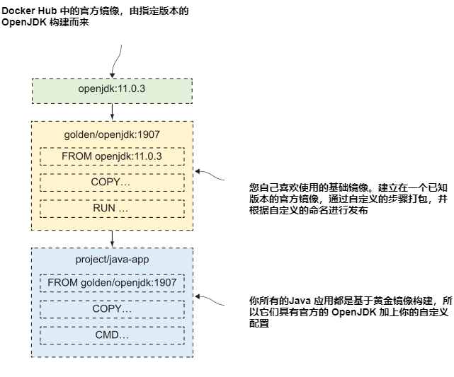

# 第五章 通过 Docker Hub 及其它仓库共享镜像

在前面几章中，您已经很好地理解了Docker工作流的构建和运行部分——现在是分享的时候了。共享就是将您在本地机器上构建的镜像提供给其他人使用。我真的认为这是Docker等式中最重要的部分。打包软件及其所有依赖项意味着任何人都可以在任何机器上轻松使用它——没有环境之间的差距，因此不需要再浪费时间设置软件或跟踪实际上是部署问题的错误。

## 5.1 使用 registry、repository 以及镜像 Tag

软件分发内置在 Docker 平台中。您已经看到可以从镜像运行容器，如果本地没有该镜像，Docker将下载它。集中存储镜像的服务器称为Docker 仓库（registry）。Docker Hub是最受欢迎的镜像仓库，拥有数十万个镜像，每个月被下载数十亿次。它也是Docker引擎的默认仓库，这意味着它是Docker寻找本地不可用镜像的第一个地方。

Docker images need a name, and that name contains enough information for Docker to find the exact image you’re looking for. So far we’ve used very simple names with one or two parts, like image-gallery or diamol/golang. There are actually four parts to a full image name (which is properly called the image refer-ence). Figure 5.1 shows all those parts in the full reference for diamol/golang:
Docker 镜像需要一个名称，该名称包含足够的信息，以便Docker找到您正在寻找的确切镜像。到目前为止，我们使用的名称都非常简单，只有一到两个部分，比如image-gallery或diamol/golang。一个完整的镜像名称实际上有四个部分(正确地称为镜像引用)。图5.1显示了diamol/golang完整参考中的所有部分:


<center>图5.1 解剖 Docker 镜像引用</center>

当您开始管理自己的应用程序镜像时，您将使用镜像引用的所有部分。在您的本地机器上，您可以为镜像命名任何您喜欢的名称，但是当您希望在仓库上共享它们时，您将需要添加更多细节，因为镜像引用是仓库上一个特定镜像的唯一标识符。

如果你不为镜像引用的某些部分提供值，Docker会使用一些默认值。默认的仓库是Docker Hub，默认的 tag 是 latest。Docker Hub的域是Docker.io。因此，我的镜像，diamol/golang，是docker.io/diamol/golang:latest的简短版本。你可以使用这些参考中的任何一个。diamol帐户是Docker Hub上的一个组织，golang是该组织中的一个存储库。它是一个公共存储库，因此任何人都可以提取镜像，但您必须是diamol组织的成员才能推送镜像。

大公司通常在自己的云环境或本地网络中有自己的Docker 仓库。通过在引用的第一部分包含域名来针对自己的仓库，因此Docker知道不要使用Docker Hub。如果我在r.sixeyed.com上托管自己的仓库，我的镜像就可以存储在r.sixeyed.com/diamol/golang上。这非常简单，但镜像引用中最重要的部分是 tag。

到目前为止，您还没有使用镜像 Tag，因为开始时不使用它们会更简单，但是当您开始构建自己的应用程序镜像时，您应该始终 tag 它们。tag 用于标识同一应用程序的不同版本。官方Docker OpenJDK镜像有数百个 tag——OpenJDK:13是最新版本，OpenJDK:8u212-jdk是Java 8的特定版本，还有更多针对不同Linux发行版和Windows版本的 tag。如果在创建镜像时没有指定 tag，Docker将使用默认tag latest。这是一个误导性的名称，因为标记为“最新”的镜像实际上可能不是最新的镜像版本。当你推送自己的镜像时，你应该总是用明确的版本来标记它们。

## 5.2 推送你自己的镜像到 Docker Hub

我们将从将您在第4章中构建的一个镜像推到 Docker Hub 开始。为此，你需要一个Docker Hub账户——如果你没有，请浏览https://hub.docker.com并按照链接注册一个账户(它是免费的，而且它不会让你的收件箱里有大量垃圾邮件)。

要将镜像推送到仓库，需要做两件事。首先，您需要使用Docker命令行登录仓库，这样Docker就可以检查您的用户帐户是否被授权推送镜像。然后，您需要为您的镜像提供一个引用，其中包括您有权推送的帐户的名称。

每个读者都有自己的Docker Hub用户名，为了便于练习，让我们先在终端会话的变量中捕获自己的Docker ID。在此之后，您将能够复制和粘贴本章的其余命令。

<b>现在就试试</b> 打开一个终端会话并将Docker Hub ID保存在一个变量中。Docker ID是您的用户名，而不是您的电子邮件地址。这是一个在Windows和Linux上不同的命令，所以你需要选择正确的选项:

```
# 使用 Windows 上的 PowerShell:
$dockerId="<输入你的 Docker id>"
# 使用 linux or mac 上的 bash:
export dockerId="<输入你的 docker id>"
```

我现在正在运行Windows，我的Docker Hub用户名是sixeyed，所以我运行的命令是$dockerId="sixeyed";在Linux上，我会运行dockerId="sixeyed"。在任何系统上，您都可以运行echo $dockerId，您应该会看到显示您的用户名。从现在开始，你可以复制练习中的命令，它们将使用你的Docker ID。

首先登录到 Docker Hub。实际上是Docker引擎推送和提取镜像，但是您使用Docker命令行进行身份验证——当您运行登录命令时，它将询问您的密码，请输入您的Docker Hub密码。

<b>现在就试试</b> 登录 Docker Hub。Hub是默认仓库，所以你不需要指定域名:

`docker login --username $dockerId`

您将看到如图5.2所示的输出——很明显，当您输入密码时，Docker不会显示密码。


<center>图5.2 登录 Docker Hub</center>

现在您已经登录，您可以将镜像推送到您自己的帐户或您可以访问的任何组织。我不认识你，但如果我想让你帮忙照看这本书的镜像，我可以把你的账号添加到diamol组织，你就可以推送以diamol/开头的镜像。如果您不是任何组织的成员，则只能在自己的帐户中将镜像推送到存储库。

你在第4章中构建了一个名为image-gallery的Docker 镜像。该镜像引用没有帐户名称，因此不能将其推送到任何仓库。您不需要重新构建镜像来给它一个新的引用-一个镜像可以有几个引用。

<b>现在就试试</b> 为现有镜像创建一个新的引用，将其标记为v1:

`docker image tag image-gallery $dockerId/image-gallery:v1`

现在你有了两个引用;其中一个有帐户和版本号，但两个引用都指向相同的镜像。镜像也有唯一的ID，如果一个镜像ID有多个引用，可以在列出它们时看到。

<b>现在就试试</b> 列出镜像 image-gallery 的引用：

`docker image ls --filter reference=image-gallery --filter reference='*/image-gallery'`

在图5.3中，您将看到与我的类似的输出，只不过您的 tag 镜像将显示您的Docker Hub用户名而不是sixeyed。


<center>图5.3 一个镜像两个引用</center>

现在，您的帐户名中有一个Docker ID的镜像引用，并且您已经登录到Docker Hub，因此您已经准备好共享您的镜像了!docker image push命令相当于pull命令;它将您的本地镜像层上传到仓库。

<b>现在就试试</b> 列出镜像 image-gallery 的引用：

`docker image push $dockerId/image-gallery:v1`

Docker 仓库在镜像层级别上的工作方式与本地Docker引擎相同。你推送一个镜像，但Docker实际上上传了镜像层。在输出中，你会看到一个层id列表和它们的上传进度。在我的(缩写)输出中，你可以看到层被推送:

```
The push refers to repository [docker.io/sixeyed/image-gallery]
c8c60e5dbe37: Pushed
2caab880bb11: Pushed
3fcd399f2c98: Pushed
...
v1: digest: sha256:127d0ed6f7a8d1... size: 2296
```

仓库与镜像层一起工作的事实是您需要花时间优化dockerfile的另一个原因。层只有在没有与该层的散列匹配的情况下才会物理上传到注册表。它就像你的本地Docker引擎缓存，但应用于仓库上的所有镜像。如果你优化到构建时90%的层来自缓存，那么当你推送时，90%的层已经在仓库中了。优化后的dockerfile减少了构建时间、磁盘空间和网络带宽。

您现在可以访问 Docker Hub并检查您的镜像。Docker Hub UI使用与镜像引用相同的存储库名称格式，因此您可以从帐户名计算出镜像的URL。

<b>现在就试试</b> 这个小脚本输出 Docker Hub上的镜像页面URL

`echo "https://hub.docker.com/r/$dockerId/image-gallery/tags"`

当您访问该URL时，您将看到如图5.4所示的内容，其中显示了镜像的Tag和最后一次更新时间。


<center>图5.4 查看 Docker Hub 中镜像</center>

这就是推送镜像的全部内容。如果镜像还不存在，Docker Hub会为镜像创建一个新的存储库，默认情况下，该存储库具有公共读权限。现在任何人都可以找到、提取和使用您的镜像库应用程序。他们需要自己弄清楚如何使用它，但是你也可以把文档放在Docker Hub上。

Docker Hub是最容易上手的仓库，它为你提供了大量零成本的功能——尽管你可以每月付费订阅额外的功能，比如私有存储库。还有很多可供选择的仓库。

仓库是一个开放的API规范，core registry server 是来自Docker的开源产品。所有的云都有自己的仓库服务，你可以在数据中心中使用Docker Trusted registry等商业产品管理自己的仓库，也可以在容器中运行一个简单的仓库。

## 5.3 运行并使用你自己的 Docker 仓库

在本地网络上运行自己的仓库非常有用。它减少了带宽的使用和传输时间，并允许您拥有环境中的数据。即使您不担心这一点，知道您可以快速启动本地仓库仍然是件好事，如果您的主仓库离线，您可以将其用作备份选项。

Docker在源代码存储库 Docker /distribution中维护GitHub上的核心注册表服务器。它为你提供了推送和拉取镜像的基本功能，它使用了与Docker Hub相同的层缓存系统，但它没有为你提供Hub所提供的web UI。它是一个超轻量级的服务器，我将它打包到一个diamol 镜像中，因此您可以在容器中运行它。

TRY IT NOW
Run the Docker registry in a container, using my image:
<b>现在就试试</b>
```
# run the registry with a restart flag so the container gets
# restarted whenever you restart Docker:
docker container run -d -p 5000:5000 --restart always diamol/registry
```

You now have a registry server on your local machine. The default port for the server is 5000, which this command publishes. You can tag images with the domain localhost:5000 and push them to this registry, but that’s not really useful—you can only use the registry on your local machine. Instead, it’s better to give your machine an alias so you can use a proper domain name for your registry.

This next command creates that alias. It will give your computer the name registry.local, in addition to any other network names it has. It does this by writing to the computer’s hosts file, which is a simple text file that links network names to IP addresses.

TRY IT NOW
Windows, Linux, and Mac machines all use the same hosts file format, but the file paths are different. The command is also different on Windows, so you’ll need to choose the right one:

```
# using PowerShell on Windows
Add-Content -Value "127.0.0.1 registry.local" -Path /windows/system32/drivers/etc/hosts
# using Bash on Linux or Mac
echo $'\n127.0.0.1 registry.local' | sudo tee -a /etc/hosts
```

If you get a permissions error from that command, you’ll need to be logged in with administrator privileges in an elevated PowerShell session on Windows, or use sudo on Linux or Mac. When you’ve run the command successfully, you should be able to run ping registry.local and see a response from your computer’s home IP address,127.0.0.1, as in figure 5.5.


<center>图5.5 为你的计算机添加新的网络别名</center>

Now you can use the domain name registry.local:5000 in your image references to use your registry. Adding the domain name to an image involves the same process of tagging that you’ve already done for Docker Hub. This time you just include the registry domain in the new image reference.

TRY IT NOW
Tag your image-gallery image with your registry domain:

`docker image tag image-gallery registry.local:5000/gallery/ui:v1`

Your local registry doesn’t have any authentication or authorization set up. That’s obviously not production quality, but it might work for a small team, and it does let you use your own image-naming schemes. Three containers make up the NASA image-of-the-day app in chapter 4—you could tag all the images to group them together using gallery as the project name:

- registry.local:5000/gallery/ui:v1—The Go web UI
- registry.local:5000/gallery/api:v1—The Java API
- registry.local:5000/gallery/logs:v1—The Node.js API

There’s one more thing you need to do before you can push this image to your local registry. The registry container is using plain-text HTTP rather than encrypted HTTPS to push and pull images. Docker won’t communicate with an unencrypted registry by default, because it’s not secure. You need to explicitly add your registry domain to a list of permitted insecure registries before Docker will let you use it.

This brings us to configuring Docker. The Docker Engine uses a JSON configuration file for all sorts of settings, including where Docker stores the image layers on disk, where the Docker API listens for connections, and which insecure registries are permitted. The file is called daemon.json and it usually lives in the folder C:\ProgramData\docker\config on Windows Server, and /etc/docker on
Linux. You can edit that file directly, but if you’re using Docker Desktop on Macor Windows, you’ll need use the UI, where you can change the main configuration settings.

TRY IT NOW
Right-click the Docker whale icon in your taskbar, and select Settings (or Preferences on the Mac). Then open the Daemon tab and enter registry.local:5000 in the insecure registries list—you can see my settings in figure 5.6.


<center>图5.6 允许在 Docker Desktop 中使用不安全协议的仓库</center>

The Docker Engine needs to be restarted to load any new configuration settings, and Docker Desktop does that for you when you apply changes.

If you’re not running Docker Desktop, you’ll need to do this manually. Start by opening the daemon.json file in a text editor—or create it if it doesn’t exist—and add the insecure registry details in JSON format. The configuration settings will look like this—but if you’re editing an existing file, be sure to leave the original settings in there too:
```
{
  "insecure-registries": [
    "registry.local:5000"
  ]
}
```

Then restart Docker using Restart-Service docker on Windows Server, or service docker restart on Linux. You can check which insecure registries your Docker Engine allows, along with a stack of other information, using the info command.

TRY IT NOW
List the information about your Docker Engine and check your registry is in the insecure registries list:

`docker info`

At the end of the output, you’ll see the registry configuration, which should include your insecure registry—you can see mine in figure 5.7.


<center>图5.7 非安全的仓库允许 Docker 使用</center>

You should be careful about adding insecure registries to your Docker configuration. Your connection could be compromised, and attackers could read layers when you push images. Or worse, they could inject their own data when you pull images. All the commercial registry servers run on HTTPS, and you can also configure Docker’s open source registry to use HTTPS. For demonstrating with a local server, however,it’s an acceptable risk.

You can now push your tagged image to your own registry. The registry domain is part of the image reference, so Docker knows to use something other than Docker Hub, and your HTTP registry running in a container is cleared in the list of insecure registries.

TRY IT NOW
Push your tagged image:

`docker image push registry.local:5000/gallery/ui:v1`

Your registry is completely empty when you run the first push, so you’ll see all the layers being uploaded. If you then repeat the push command, you’ll see that all the layers already exist and nothing gets uploaded. That’s all you need to do to run your own Docker registry in a container. You could share it on your network using your machine’s IP address or the real domain name.

## 5.4 有效运用镜像 Tag

You can put any string into a Docker image tag, and as you’ve already seen, you can have multiple tags for the same image. You’ll use that to version the software in your images and let users make informed choices about what they want to use—and to make your own informed choices when you use other people’s images.

Many software projects use a numeric versioning scheme with decimal points to indicate how big a change there is between versions, and you can do that with your image tags. The basic idea is something like [major].[minor].[patch], which has some implicit guarantees. A release that only increments the patch number might have bug fixes, but it should have the same features as the last version; a release that increments the minor version might add features but shouldn’t remove any; and a major release could have completely different features.

If you use the same approach with your image tags, you can let users choose whether to stick to a major version or a minor version, or just always have the latest release.

TRY IT NOW
Create a few new tags for the Go application you have packaged in the image to indicate the major, minor, and patch release versions:
```
docker image tag image-gallery registry.local:5000/gallery/ui:latest
docker image tag image-gallery registry.local:5000/gallery/ui:2
docker image tag image-gallery registry.local:5000/gallery/ui:2.1
docker image tag image-gallery registry.local:5000/gallery/ui:2.1.106
```

Now imagine that an application has monthly releases, which increment the version numbers. Figure 5.8 shows how the image tags might evolve over releases from July to October.


<center>图5.8 软件发布期间镜像tag的演变</center>

You can see that some of these image tags are a moving target. gallery/ui:2.1 is an alias for the 2.1.106 release in July, but in August the same 2.1 tag is an alias for the 2.1.114 release. gallery/ui:2 is also an alias for 2.1.106 in July, but by September the 2 tag is an alias for the 2.2.11 release. The latest tag has the most movement—in July gallery/ui is an alias for 2.1.106, but in October it’s an alias for 3.0.42.

This is a typical versioning scheme you’ll see for Docker images. It’s one you should adopt yourself, because it lets users of your image choose how current they want to be. They can pin to a specific patch version in their image pull commands, or in the FROM instruction in their Dockerfiles, and be sure that the image they use will always be the same. The 2.1.106 tag in this example is the same image from July through October. If they want to get patch updates, they can use the 2.1 tag, and if they want to get minor releases they can use the 2 tag.

Any of those choices is fine; it’s just a case of balancing risk—using a specific patch version means the application will be the same whenever you use it, but you won’t get security fixes. Using a major version means you’ll get all the latest fixes, but there might be unexpected feature changes down the line.

It’s especially important to use specific image tags for the base images in your own Dockerfiles. It’s great to use the product team’s build tools image to build your apps and their runtime image to package your apps, but if you don’t specify versions in the tags, you’re setting yourself up for trouble in the future. A new release of the build image could break your Docker build. Or worse, a new release of the runtime could break your application.

## 5.5 转换官方镜像为黄金镜像

There’s one last thing to understand when you’re looking at Docker Hub and other registries: can you trust the images you find there? Anyone can push an image to Docker Hub and make it publicly available. For hackers, that’s a nice way to distribute malware; you just need to give your image an innocent name and a fake description, and wait for people to start using it. Docker Hub solves that problem with verified publishers and official images.

Verified publishers are companies like Microsoft, Oracle, and IBM, who publish images on Docker Hub. Their images go through an approval process that includes security scanning for vulnerabilities; they may also be certified, which means they have the backing of Docker and the publisher. If you want to run off-the-shelf software in containers, certified images from verified publishers are the best bet.

Official images are something different—they’re usually open source projects, maintained jointly by the project team and Docker. They’re security scanned and regularly updated, and they conform to Dockerfile best practices. All the content for the official images is open source, so you can see the Dockerfiles on GitHub. Most people start using official images as the base for their own images but at some point find they need more control. Then they introduce their own preferred base images, called golden images—figure 5.9 shows you how it works.


<center>图5.9 使用一个黄金镜像来封装官方镜像</center>

Golden images use an official image as the base and then add in whatever custom setup they need, such as installing security certificates or configuring default environment settings. The golden image lives in the company’s repositories on Docker Hubor in their own registry, and all application images are based on the golden image. This approach offers the benefits of the official image—with the best-practice setup by the project team—but with the extra config you need.

TRY IT NOW
There are two Dockerfiles in the source code for this chapter that can be built as golden images for .NET Core apps. Browse to each folder and build the image:
```
cd ch05/exercises/dotnet-sdk
docker image build -t golden/dotnetcore-sdk:3.0 .

cd ../aspnet-runtime
docker image build -t golden/aspnet-core:3.0 .
```

There’s nothing special about golden images. They start with a Dockerfile, and that builds an image with your own reference and naming scheme. If you look at the Docker-files you’ve built, you’ll see that they add some metadata to the image using the LABEL instruction, and they set up some common configuration. Now you can use those images in a multi-stage Dockerfile for a .NET Core application, which would look something like listing 5.1.

> Listing 5.1 A multi-stage Dockerfile using .NET Core golden images

```
FROM golden/dotnetcore-sdk:3.0 AS builder
COPY . .
RUN dotnet publish -o /out/app app.csproj
FROM golden/aspnet-core:3.0
COPY --from=builder /out /app
CMD ["dotnet", "/app/app.dll"]
```

The application Dockerfile has the same format as any multi-stage build, but now you own the base images. The official images may have a new release every month, but you can choose to restrict your golden images to quarterly updates. And golden images open up one other possibility—you can enforce their use with tools in your continuous integration (CI) pipeline: Dockerfiles can be scanned, and if someone tries to build an app without using golden images, that build fails. It’s a good way of locking down the source images teams can use.


## 5.6 实验室

This lab is going to take some detective work, but it will be worth it in the end. You’re going to need to dig around the Docker Registry API v2 specification (https://docs.docker.com/registry/spec/api/), because the REST API is the only way you can interact with your local Docker registry—you can’t search or delete images using the Docker CLI (yet).

The goal for this lab is to push all the tags for your gallery/ui image to your local registry, check that they’re all there, and then delete them all and check that they’re gone. We won’t include the gallery/api or gallery/logs images because this lab focuses on images with multiple tags, and we have those for gallery/ui. Here are a few hints:
- You can use a single image push command to push all these tags.
- The URL for your local registry API is http://registry.local:5000/v2.
- Start by listing the image tags for the repository.
- Then you’ll need to get the image manifest.
- You can delete images through the API, but you need to use the manifest.
- Read the docs—there’s a specific request header you need to use in your HEAD request.

The solution is on the book’s GitHub repository, and this is a rare case where it’s OK to cheat a little. The first couple of steps should be straightforward for you to work out, but then it gets a little awkward, so don’t feel too bad if you end up heading here: https://github.com/sixeyed/diamol/tree/master/ch05/lab.

Good luck. And remember to read the docs.