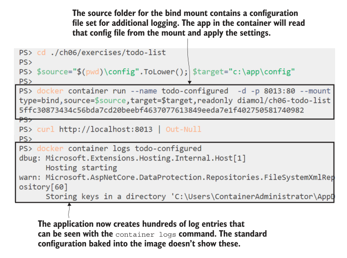

# 第六章 使用 Docker Volumes 作为持久化存储

容器是无状态应用程序的完美运行时。您可以通过在集群上运行多个容器来满足不断增长的需求，因为每个容器都将以相同的方式处理请求。你可以通过自动滚动升级来发布更新，这可以让你的应用一直在线。

但并非应用程序的所有部分都是无状态的。将会有使用磁盘来提高性能或永久存储数据的组件。你也可以在Docker容器中运行这些组件。

存储确实增加了复杂性，因此您需要了解如何Dockerize有状态应用程序。本章带您了解Docker的卷和挂载，并向您展示容器文件系统是如何工作的。
## 6.1 为什么容器中的数据不是永久的

Docker 容器有一个带有单个磁盘驱动器的文件系统，该驱动器的内容由来自映像的文件填充。你们已经看到了:
当你在Dockerfile中使用COPY指令时，当你从镜像运行容器时，你复制到镜像中的文件和目录就在那里。你知道Docker镜像存储为多层，所以容器的磁盘实际上是一个虚拟文件系统，Docker将所有镜像层合并在一起。

每个容器都有自己的文件系统，独立于其他容器。您可以从同一个Docker映像运行多个容器，它们都将以相同的磁盘内容开始。应用程序可以更改一个容器中的文件，而不会影响其他容器或映像中的文件。通过运行两个写入数据的容器，然后查看它们的输出，可以很容易地看出这一点。

<b>现在就试试</b>打开一个终端会话并从同一个镜像运行两个容器。镜像中的应用程序将一个随机数写入容器中的文件:

```
docker container run --name rn1 diamol/ch06-random-number
docker container run --name rn2 diamol/ch06-random-number
```

该容器在启动时运行一个脚本，脚本将一些随机数据写入文本文件，然后结束，因此这些容器处于退出状态。这两个容器从相同的镜像开始，但它们将具有不同的文件内容。你在第二章中了解到Docker在容器退出时不会删除容器的文件系统——它会被保留，所以你仍然可以访问文件和文件夹。

Docker CLI中有Docker container cp命令，用于在容器和本地机器之间复制文件。您可以指定容器的名称和文件路径，然后使用它将生成的随机数文件从这些容器复制到您的主机计算机上，以便读取内容。

<b>现在就试试</b> 使用docker容器cp从每个容器中复制随机数文件，然后检查内容:

```
docker container cp rn1:/random/number.txt number1.txt
docker container cp rn2:/random/number.txt number2.txt
cat number1.txt
cat number2.txt
```

您的输出将类似于图6.1中我的输出。每个容器都在相同的路径/random/number.txt上写了一个文件，但是当将这些文件复制到本地计算机上时，您可以看到内容是不同的。这是一种显示每个容器都有独立文件系统的简单方法。在这种情况下，它是一个不同的文件，但这些可以是数据库容器，以运行相同的SQL引擎开始，但存储完全不同的数据。


<center>图6.1 </center>

容器中的文件系统看起来是一个单独的磁盘:Linux容器中的/dev/sda1, Windows容器中的C:\。但是这个磁盘是一个虚拟文件系统，Docker从多个源构建它，并将它作为一个单元呈现给容器。该文件系统的基本来源是镜像层(可以在容器之间共享)和容器的可写层(对于每个容器都是惟一的)。

图6.2显示了如何查找随机数镜像和两个容器。您应该从图6.2中了解到两件重要的事情:镜像层是共享的，因此它们必须是只读的;每个容器都有一个可写层，它具有与容器相同的生命周期。镜像层有它们自己的生命周期——您提取的任何镜像都将保留在本地缓存中，直到删除它们。但是容器可写层是在容器启动时由Docker创建的，在容器被移除时由Docker删除。(停止容器不会自动删除它，这样停止的容器的文件系统仍然存在。)


<center>图6.2 </center>

当然，可写层不仅仅用于创建新文件。容器可以从镜像层编辑现有文件。但是镜像层是只读的，所以Docker使用了一些特殊的魔法来实现这一点。它使用写时复制过程来允许编辑来自只读层的文件。当容器试图编辑镜像层中的文件时，Docker实际上会将该文件复制到可写层，并在那里进行编辑。容器和应用程序都是无缝的，但这是Docker超高效使用存储的基石。

在继续运行一些更有用的有状态容器之前，让我们用另一个简单的示例来解决这个问题。在本练习中，您将运行一个容器，它从镜像层打印出文件的内容。然后更新文件内容并再次运行容器以查看更改的内容。

<b>现在就试试</b>运行这些命令启动一个容器，打印出它的文件内容，然后更改文件，并再次启动容器打印出新的文件内容:

```
docker container run --name f1 diamol/ch06-file-display
echo "http://eltonstoneman.com" > url.txt
docker container cp url.txt f1:/input.txt
docker container start --attach f1
```

这一次，您使用Docker将一个文件从主机复制到容器中，目标路径是容器显示的文件。当您再次启动容器时，同样的脚本将运行，但是现在它打印出不同的内容—您可以在图6.3中看到我的输出。


<center>图6.3 </center>

修改容器中的文件会影响该容器的运行方式，但不会影响镜像或该镜像中的任何其他容器。更改后的文件只存在于该容器的可写层中——新容器将使用镜像中的原始内容，当容器f1被删除时，更新后的文件就消失了。

TRY IT NOW
Start a new container to check that the file in the image is unchanged. Then remove the original container and confirm that the data is gone:

<b>现在就试试</b>启动一个新容器以检查镜像中的文件是否没有改变。然后删除原来的容器，并确认数据已经消失:

```
docker container run --name f2 diamol/ch06-file-display
docker container rm -f f1
docker container cp f1:/input.txt 
```

您将在图6.4中看到与我的输出相同的输出。新容器使用镜像中的原始文件，当您删除原始容器时，它的文件系统也被删除，更改后的文件将永远消失。


<center>图6.4</center>

容器文件系统具有与容器相同的生命周期，因此当容器被移除时，可写层也被移除，容器中任何更改的数据都将丢失。移除容器是你需要做很多事情的。在生产环境中，您可以通过构建新镜像、删除旧容器并将其替换为更新镜像中的新容器来升级应用程序。在原始应用程序容器中写入的任何数据都将丢失，替换容器将从镜像中的静态数据开始。

在某些情况下，这是可以接受的，因为应用程序只写入临时数据(可能是为了保存计算或检索成本较高的数据的本地缓存)，替换容器从空缓存开始是可以接受的。在其他情况下，这将是一场灾难。您可以在容器中运行数据库，但您不会期望在推出更新的数据库版本时丢失所有数据。

Docker也为您提供了这些场景。容器的虚拟文件系统总是从镜像层和可写层构建，但也可以有其他源。这些是Docker卷和挂载。它们具有独立于容器的生命周期，因此可以用于存储在容器替换之间持续存在的数据。

## 6.2 运行容器使用 Docker volumes

Docker 卷是一个存储单元——您可以把它看作容器的u盘。卷独立于容器而存在，并且有它们自己的生命周期，但是它们可以附加到容器。卷是在数据需要持久化时为有状态应用程序管理存储的方法。创建卷并将其附加到应用程序容器;它显示为容器文件系统中的一个目录。容器将数据写入目录，目录实际上存储在卷中。当你用新版本更新你的应用程序时，你将相同的卷附加到新容器，所有原始数据都是可用的。

有两种方法将卷与容器一起使用:您可以手动创建卷并将它们附加到容器上，或者您可以使用Dockerfile中的VOLUME指令。这将构建一个镜像，该镜像将在启动容器时创建一个卷。语法就是VOLUME <target-directory>。清单6.1显示了镜像 diamol/ch06-todo-list 的多阶段Dockerfile的一部分，这是一个使用卷的有状态应用程序。

> 清单 6.1 使用卷的多阶段 Dockerfile 的一部分

```
FROM diamol/dotnet-aspnet
WORKDIR /app
ENTRYPOINT ["dotnet", "ToDoList.dll"]

VOLUME /data
COPY --from=builder /out/ .
```

当您从这个镜像运行容器时，Docker将自动创建一个卷并将其附加到容器。容器将在/data(或Windows容器上的C:\data)处有一个目录，它可以正常地读取和写入该目录。但数据实际上存储在一个卷中，在容器被移除后，该卷将继续存在。如果从镜像运行一个容器，然后检查卷，就可以看到这一点。

TRY IT NOW
Run a container for the to-do list app, and have a look at the volume Docker created:

<b>现在就试试</b>运行一个用于待办事项列表应用程序的容器，看看Docker创建的卷:

```
docker container run --name todo1 -d -p 8010:80 diamol/ch06-todo-list
docker container inspect --format '{{.Mounts}}' todo1
docker volume ls
```

您将看到如图6.5所示的输出。Docker为这个容器创建一个卷，并在容器运行时附加它。我过滤了卷列表，只显示容器的卷。


<center>图6.5 </center>

Docker 卷对于在容器中运行的应用程序是完全透明的。浏览到http://localhost:8010，你会看到待办事项应用程序。应用程序将数据存储在/data目录下的文件中，因此当你通过web页面添加项目时，它们被存储在Docker卷中。图6.6显示了应用程序的运行情况——它是一个特殊的待办事项列表，非常适合像我这样工作量大的人;你可以添加项目，但你永远不能删除它们。


<center>图6.6 </center>

在 Docker 镜像中声明的卷是为每个容器创建单独的卷，但您也可以在容器之间共享卷。如果你启动一个运行待办事项应用程序的新容器，它将有自己的卷，待办事项列表将开始为空。但是您可以使用volumes-from标志运行一个容器，它附加了另一个容器的卷。在这个例子中，你可以有两个共享相同数据的待办事项应用程序容器。

<b>现在就试试</b>运行第二个待办事项列表容器并检查数据目录的内容。然后将其与另一个共享第一个容器的卷的新容器进行比较(Windows和Linux的exec命令略有不同):

```
# 这个新容器将有自己的卷
docker container run --name todo2 -d diamol/ch06-todo-list

# on Linux:
docker container exec todo2 ls /data

# on Windows:
docker container exec todo2 cmd /C "dir C:\data"

# 这个容器将共享来自todo1的卷
docker container run -d --name t3 --volumes-from todo1 diamol/ch06-
todo-list

# on Linux:
docker container exec t3 ls /data

# on Windows:
docker container exec t3 cmd /C "dir C:\data"
```

输出将如图6.7所示(本例中我在Linux上运行)。第二个容器以一个新卷开始，因此/data目录为空。第三个容器使用来自第一个容器的卷，因此它可以看到来自原始应用程序容器的数据。


<center>图6.7 </center>

在容器之间共享卷很简单，但这可能不是您想要做的。写入数据的应用程序通常期望独占访问文件，如果另一个容器同时读写同一个文件，它们可能无法正常工作(或根本无法工作)。卷更好地用于在应用程序升级之间保存状态，然后更好地显式地管理卷。您可以创建一个命名卷，并将其附加到应用程序容器的不同版本。

<b>现在就试试</b>创建一个卷，并在todo应用程序版本1的容器中使用它。然后在UI中添加一些数据，并将应用程序升级到版本2。容器的文件系统路径需要与操作系统匹配，所以我使用变量使复制和粘贴更容易:

```
# save the target file path in a variable:
target='/data' # for Linux containers
$target='c:\data' # for Windows containers

# create a volume to store the data:
docker volume create todo-list

# run the v1 app, using the volume for app storage:
docker container run -d -p 8011:80 -v todo-list:$target --name todo-v1
diamol/ch06-todo-list

# add some data through the web app at http://localhost:8011

# remove the v1 app container:
docker container rm -f todo-v1

# and run a v2 container using the same volume for storage:
docker container run -d -p 8011:80 -v todo-list:$target --name todo-v2
diamol/ch06-todo-list:v2
```

图6.8中的输出显示卷有自己的生命周期。它在创建任何容器之前就存在，并且在删除使用它的容器时仍然存在。应用程序在升级之间保留数据，因为新容器使用与旧容器相同的卷。


<center>图6.8 </center>

现在，当您浏览到http://localhost:8011时，您将看到待办事项应用程序的版本2，它已经从一个昂贵的创意机构进行了UI改造。图6.9显示现在可以投入生产了。


<center>图6.9 </center>

在我们继续之前，有一件事需要弄清楚。Dockerfile中的VOLUME指令和运行容器的VOLUME(或v)标志是分开的特性。如果run命令中没有指定卷，则使用VOLUME指令构建的镜像将始终为容器创建卷。卷将有一个随机ID，因此您可以在容器消失后使用它，但前提是您可以计算出哪个卷拥有您的数据。

卷标志将卷挂载到容器中，无论镜像是否指定了卷。如果镜像确实有卷，卷标志可以为容器覆盖它，为相同的目标路径使用一个现有卷——这样就不会创建一个新卷。这就是待办事项列表容器的情况。

对于镜像中没有指定卷的容器，可以使用完全相同的语法并获得相同的结果。作为镜像作者，您应该使用VOLUME指令作为有状态应用程序的故障安全选项。这样，即使用户没有指定卷标志，容器也将始终将数据写入持久卷。但是作为镜像用户，最好不要依赖默认值，而是使用命名卷。

## 6.3 运行容器使用文件系统挂载

卷可以很好地分离存储的生命周期，并且仍然可以让Docker为您管理所有资源。卷位于主机上，因此它们与容器分离。Docker还提供了一种在容器和主机之间使用绑定挂载共享存储的更直接的方式。绑定挂载使主机上的目录作为容器上的路径可用。绑定挂载对容器是透明的——它只是容器文件系统的一部分的目录。但这意味着您可以从容器访问主机文件，反之亦然，这就揭示了一些有趣的模式。

绑定挂载允许显式地使用主机上的文件系统来存放容器数据。这可能是一个快速的固态磁盘，一个高可用的磁盘阵列，甚至是一个可以通过网络访问的分布式存储系统。如果您可以在主机上访问该文件系统，则可以将其用于容器。我可以有一个带有RAID阵列的服务器，并将其用作待办事项列表应用程序数据库的可靠存储。

<b>现在就试试</b>我确实有一个带有RAID阵列的服务器，但你可能没有，所以我们只在你的主机上创建一个本地目录，并将其绑定挂载到一个容器中。同样，文件系统路径需要与主机操作系统相匹配，因此我已经为您机器上的源路径和容器的目标路径声明了变量。注意Windows和Linux的不同内容:

```
$source="$(pwd)\databases".ToLower(); $target="c:\data" # Windows
source="$(pwd)/databases" && target='/data' # Linux

mkdir ./databases

docker container run --mount type=bind,source=$source,target=$target
-d -p 8012:80 diamol/ch06-todo-list

curl http://localhost:8012

ls ./databases
```

本练习使用 curl 命令(在Linux、Mac和Windows系统上)向待办事项应用程序发出 HTTP 请求。这将导致应用程序启动，从而创建数据库文件。最后一个命令列出主机上本地数据库目录的内容，这将显示应用程序的数据库文件实际上在主机计算机上，如图6.10所示。


<center>图6.10 </center>

绑定挂载是双向的。您可以在容器中创建文件并在主机上编辑它们，也可以在主机上创建文件并在容器中编辑它们。这里有一个安全方面的问题，因为容器通常应该作为最低权限帐户运行，以最大限度地降低攻击者利用您的系统的风险。但是容器需要更高的权限来读写主机上的文件，因此这个镜像是用 Dockerfile 中的 USER 指令构建的，以赋予容器管理权限——它在 Linux 中使用内置的 root用户，在Windows中使用ContainerAdministrator用户。

如果不需要写入文件，可以在容器内将主机目录绑定为只读挂载。这是将配置设置从主机转移到应用程序容器的一个选项。待办事项应用程序镜像打包在一个默认配置文件中，该文件将应用程序的日志记录级别设置为最小值。您可以从相同的镜像运行容器，但将本地配置目录挂载到容器中，并在不更改映像的情况下重写应用程序的配置。

<b>现在就试试</b>如果存在的话，to-do应用程序将从/app/config路径加载一个额外的配置文件。运行一个容器，绑定挂载一个本地目录到该位置，应用程序将使用主机的配置文件。首先导航到DIAMOL源代码的本地副本，然后运行这些命令:

```
cd ./ch06/exercises/todo-list

# 将源路径保存为变量:
$source="$(pwd)\config".ToLower(); $target="c:\app\config" # Windows
source="$(pwd)/config" && target='/app/config' # Linux

# 使用挂载运行容器:
docker container run --name todo-configured -d -p 8013:80 --mount
type=bind,source=$source,target=$target,readonly diamol/ch06-
todo-list

# 检查应用:
curl http://localhost:8013

# 以及容器日志:
docker container logs todo-configured
```

主机目录中的配置文件设置为使用更详细的日志记录。当容器启动时，它映射该目录，应用程序看到配置文件并加载日志记录配置。在图6.11所示的最终输出中，有许多调试日志行，应用程序不会使用标准配置编写这些行。


<center>图6.11 </center>

您可以绑定挂载主机计算机可以访问的任何源。您可以在Linux主机上使用挂载到/mnt/nfs的共享网络驱动器，或者在Windows主机上使用映射到X:驱动器的共享网络驱动器。它们中的任何一个都可以作为绑定挂载的源，并以相同的方式被显示到容器中。对于在容器中运行的有状态应用程序来说，这是一种非常有用的获得可靠甚至分布式存储的方法，但您需要了解一些限制。

## 6.4 文件系统挂载的局限性

要有效地使用绑定挂载和卷，您需要了解一些关键场景和限制，其中一些非常微妙，只会出现在容器和文件系统的不寻常组合中。

第一个场景很简单:当您运行带有挂载的容器时，挂载目标目录已经存在并且包含来自镜像层的文件，会发生什么?您可能认为Docker会将源文件合并到目标文件中。在容器中，您希望看到目录中有来自镜像的所有现有文件，以及来自挂载的所有新文件。但事实并非如此。当您挂载一个已经有数据的目标时，源目录将取代目标目录—因此来自镜像的原始文件不可用。

您可以通过一个简单的练习看到这一点，使用一个在运行时列出目录内容的镜像。Linux 和 Windows 容器的行为是相同的，但是命令中的文件系统路径需要与操作系统匹配。

<b>现在就试试</b>在不挂载的情况下运行容器，它将列出镜像中的目录内容。再次挂载运行它，它将列出源目录的内容(这里也有变量来支持Windows和Linux):

```
cd ./ch06/exercises/bind-mount

$source="$(pwd)\new".ToLower(); $target="c:\init" # Windows
source="$(pwd)/new" && target='/init' # Linux

docker container run diamol/ch06-bind-mount

docker container run --mount type=bind,source=$source,target=$target
diamol/ch06-bind-mount
```

在第一次运行中，您将看到容器列出了两个文件:abc.txt和def.txt。它们从镜像层加载到容器中。第二个容器将目标目录替换为挂载中的源目录，因此不会列出这些文件。只显示文件123.txt和456.txt，它们来自主机上的源目录。图6.12显示了我的输出。


<center>图6.12 </center>

第二个场景是该场景的变体:如果将一个文件从主机挂载到容器文件系统中存在的目标目录，会发生什么?这一次，目录内容被合并，因此您将看到来自镜像的原始文件和来自主机的新文件——除非您运行的是Windows容器，在Windows容器中根本不支持该特性。

容器文件系统是Windows容器与Linux容器不同的少数领域之一。有些事情确实以同样的方式起作用。你可以在dockerfile中使用标准的linux风格的路径，因此/data适用于Windows容器，并成为C:\data的别名。但这对卷挂载和绑定挂载不起作用，这就是为什么本章的练习使用变量来给出Linux users /data和Windows C:\data。

对单个文件挂载的限制更为明确。如果你有Windows和Linux机器可用，或者你在Windows上运行Docker Desktop (Docker Desktop同时支持Linux和Windows容器)，你可以自己试试。

<b>现在就试试</b>单文件挂载的行为在Linux和Windows上是不同的。如果你有可用的Linux和Windows容器，你可以看到它在运行:

```
cd ./ch06/exercises/bind-mount

# on Linux:
docker container run --mount
type=bind,source="$(pwd)/new/123.txt",target=/init/123.txt
diamol/ch06-bind-mount

# on Windows:
docker container run --mount
type=bind,source="$(pwd)/new/123.txt",target=C:\init\123.txt
diamol/ch06-bind-mount

docker container run diamol/ch06-bind-mount

docker container run --mount
type=bind,source="$(pwd)/new/123.txt",target=/init/123.txt
diamol/ch06-bind-mount
```

Docker 镜像是相同的，命令也是相同的——除了目标的特定于os的文件系统路径。但是当您运行它时，您将看到Linux示例按预期工作，但是在Windows上从Docker得到一个错误，如图6.13所示。


<center>图6.13 </center>

第三种情况不太常见。如果不设置许多移动的部件，就很难重现它，所以不会有一个练习来涵盖这一点——你必须相信我的话。场景是，如果将分布式文件系统绑定挂载到容器中会发生什么?容器中的应用程序还能正常工作吗?看，这个问题也很复杂。

分布式文件系统允许您从网络上的任何机器访问数据，它们通常使用不同于操作系统本地文件系统的存储机制。它可以是本地网络上的SMB文件共享、Azure文件或云中的AWS S3等技术。您可以将这些分布式存储系统中的位置装入容器中。挂载看起来像文件系统的正常部分，但如果它不支持相同的操作，应用程序可能会失败。

图6.14中有一个具体的例子，尝试在云上的容器中运行Postgres数据库系统，使用Azure文件作为容器存储。Azure Files支持正常的文件系统操作，比如读和写，但它不支持应用程序可能使用的一些更不寻常的操作。在这种情况下，Postgres容器尝试创建一个文件链接，但Azure文件不支持该功能，因此应用程序崩溃。


<center>图6.14 </center>

这种情况是一个异常值，但你需要意识到它，因为如果它发生了，就真的没有办法了。绑定挂载的源代码可能不支持容器中应用程序所期望的所有文件系统特性。这是你无法计划的——除非你在你的存储系统上试用你的应用程序，否则你不会知道。如果希望对容器使用分布式存储，则应该了解这种风险，并且还需要了解分布式存储与本地存储的性能特征非常不同。如果您在具有分布式存储的容器中运行一个使用大量磁盘的应用程序，那么它可能会停止运行，其中每个文件写入都要经过网络。

## 6.5 理解容器文件系统如何构建

我们在本章已经讲了很多。存储是一个重要的主题，因为容器的选项与物理计算机或虚拟机上的存储非常不同。最后，我将对我们讨论的所有内容进行综合分析，并提供一些使用容器文件系统的最佳实践指南。

每个容器都有一个磁盘，这是一个虚拟磁盘，由Docker从几个来源拼接而成。Docker称之为联合文件系统。我不打算讨论Docker如何实现联合文件系统，因为不同的操作系统有不同的技术。当你安装Docker时，它会为你的操作系统做出正确的选择，所以你不需要担心细节。

联合文件系统允许容器看到单个磁盘驱动器，并以相同的方式处理文件和目录，无论它们位于磁盘上的哪个位置。但是磁盘上的位置可以物理地存储在不同的存储单元中，如图6.15所示。


<center>图6.15 </center>

容器内的应用程序只能看到一个磁盘，但作为镜像作者或容器用户，您可以为该磁盘选择源。一个容器中可以有多个镜像层、多个卷挂载和多个绑定挂载，但它们始终只有一个可写层。下面是一些关于如何使用存储选项的一般指南:

- 可写层-非常适合短期存储，例如将数据缓存到磁盘以节省网络调用或计算。这些对每个容器都是唯一的，但当容器被移除时，它们就永远消失了。

- 本地绑定挂载—用于主机和容器之间的数据共享。开发人员可以使用绑定挂载将计算机上的源代码加载到容器中，因此当他们对HTML或JavaScript文件进行本地编辑时，所做的更改立即在容器中，而无需构建新的镜像。

- 分布式绑定挂载—用于网络存储和容器之间的数据共享。这些都很有用，但您需要注意网络存储的性能与本地磁盘不同，可能无法提供完整的文件系统特性。它们可以用作配置数据或共享缓存的只读源，也可以用作读写源来存储可以被任意容器上的任意容器使用的数据同一网络上的机器。

- 卷挂载—用于容器与Docker管理的存储对象之间的数据共享。这对于持久存储非常有用，在持久存储中应用程序将数据写入卷。当你用一个新的容器升级你的应用程序时，它会保留之前版本写入卷的数据。
- 镜像层——它们为容器提供了初始文件系统。层是堆叠的，最新的层覆盖较早的层，因此在Dockerfile开始的层中写入的文件可以被写入相同路径的后续层覆盖。层是只读的，它们可以在容器之间共享。
## 6.6 实验室

我们会在实验室里把这些碎片拼起来。它又回到了以前的待办事项列表应用程序，但这次有了一些变化。应用程序将在容器中运行，并以一组已经创建的任务开始。你的任务是使用相同的镜像，但使用不同的存储选项运行应用程序，这样待办事项列表开始时是空的，当你保存项目时，它们会存储到Docker卷中。本章的练习应该会让你达到目的，但这里有一些提示:

- 记住它是docker rm -f $(docker ps -aq)来删除所有现有的容器。
- 首先从 diamol/ch06-lab 运行应用程序来检查任务。
- 然后你需要运行一个容器从相同的映像与一些挂载。
- 应用程序使用配置文件-这里有更多的日志设置。

如果你需要的话，我的示例解决方案在本书的GitHub存储库上，但你应该尝试使用这个解决方案，因为如果你没有太多的经验，容器存储可能会让你绊倒。有几种方法可以解决这个问题。我的解决方案在这里:https://github.com/yyong-brs/learn-docker/tree/master/diamol/ch06/lab/README.md。